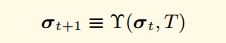
! [화상 (영상 / sign_state_3.png) + 1 상태는 t 시간 (트라이 계정)이다.
실행 엔진이 이해할 수있는 바와 같이! [화상 (영상 / sign_state_4.png)는 상태 천이 함수
! [이미지] (사진 / sign_state_5.png)는 트랜잭션이다. 트랜잭션.
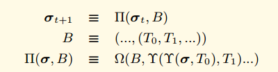
! [화상 (영상 / sign_state_7.png)는 상태 전이 함수 블록 레벨이다.
! [화상 (영상 / sign_state_8.png) B는 여러 트랜잭션으로 구성된 블록이다.
! [이미지] 트랜잭션 (사진 / sign_state_9.png) 0 위치
! [화상 (영상 / sign_state_10.png) Ω는 블록 끝 상태 천이 함수 (보상 굴착기의 함수) 인
! [이미지] (사진 / sign_ether.png) 에테르 식별
! [화상 (영상 / sign_ether_value.png) 에테르 값
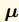 machine-state

## 몇 가지 기본 규칙

- 대부분의 기능 들어, 대문자로 식별 할 수 있습니다.
- 튜플은 일반적으로 대문자로 확인
- 스칼라 또는 바이트의 고정 크기 어레이 소문자에 의해 식별된다. 예를 들어, 비표를 들어 n은 트랜잭션을 나타내는 등 필요한 주어진 명령의 δ 스택 데이터의 대표로 일부 예외가있을 수 있습니다 가능성을.
- 일반적으로 소문자 굵은 바이트의 가변 길이 배열. 예를 들어 O ** ** 메시지 호출의 출력 데이터를 나타낸다. 몇 가지 중요한 굵은에서 대문자를 사용할 수 있습니다 들어

! [화상 (영상 / sign_set_b.png) 바이트 순서
! [이미지] (사진 / sign_set_p.png) 양의 정수
! 바이트 시퀀스 [화상 (영상 / sign_set_b32.png) 32 바이트 길이
! [화상 (영상 / sign_set_p256.png)의 양의 정수보다 작은 2 ^ 256
내부 대응 요소 ** [] ** 배열 인덱스
제 객체 스택 시스템 (시스템의 스택)의! [화상 (영상 / sign_stack.png) 대표
! [화상 (영상 / sign_memory.png)는 내부 메모리 시스템 (시스템 메모리)에 제 32 개의 요소를 나타내는
! [이미지 (사진 / sign_placeholder_1.png) 플레이스 홀더는 모든 문자는 객체를 대표 할 수있다

! [이미지 (영상 / sign_placeholder_2.png) 객체의 대표 값을 수정해야
! [화상 (영상 / sign_placeholder_3.png) 중간 상태
! [화상 (영상 / sign_placeholder_4.png) 중간 상태 2

! [화상 (영상 / sign_func_1.png)! [화상 (영상 / sign_func_2.png) 이전 f는 함수를 나타낸다면, 함수 f의 *의 후면이 안면을 나타내지 만, 순차 소자의 내부 함수 F의 구현.

! [화상 (영상 / sign_last_item.png)의 내부에서의 최종 요소를 나타냄
! [화상 (영상 / sign_last_item_1.png)의 내부에서의 최종 요소를 나타냄
! [이미지] (사진 / sign_seq_item.png) 길이 X를 찾을 수

! [이미지] (사진 / sign_state_nonce.png) 주소의 대표, 비표 대신 계정
! [이미지] (사진 / sign_state_balance.png) banlance 균형
의! [이미지] (사진 / sign_state_root.png) 저장 트라이 루트 해시
! 해시의 [이미지] (사진 / sign_state_code.png) 코드입니다. 코드는되도록이면 한국 도로 공사 (B) ===이 해시 나

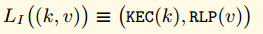 

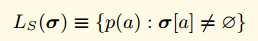  world state collapse function
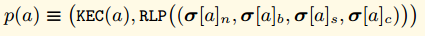

! [화상 (영상 / sign_math_any.png) 임의
! [화상 (영상 / sign_math_or.png) 및 설정하거나
! [이미지] (사진 / sign_math_and.png) 교차점

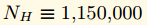 Homestead
## 거래

! 난스 [화상 (영상 / sign_t_nonce.png) 트랜잭션
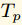 gasPrice
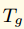 gasLimit
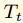 to
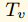 value

! [화상 (영상 / sign_t_w.png)! [화상 (영상 / sign_t_tr.png!) 송신자의 주소로 세 값을 얻을 수있다 [이미지 (영상 / sign_t_ts.png)

! [이미지] (사진 / sign_t_ti.png) 계약 초기화 코드
! [화상 (영상 / sign_t_data.png) 메소드 호출 파라미터에
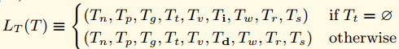 

## 헤더 영역

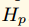ParentHash
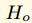OmmersHash
! [이미지] (사진 / sign_h_c.png) 수익자 광부 주소
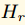stateRoot
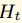transactionRoot
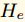receiptRoot
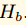logsBloom
! [이미지] (사진 / sign_h_d.png) 어려움
! [화상 (영상 / sign_h_i.png) 번호 높이
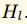gasLimit
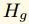gasUsed
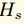timestamp
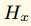extraData
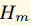mixHash
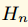nonce
## 영수증

! [이미지] 영수증 (사진 / sign_r_i.png) i 번째 거래

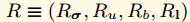
! [이미지] (사진 / sign_r_state.png) 무역 실행 세계 상태 후
! [이미지] 후 (사진 / sign_r_gasused.png) 무역 실행 전체 가스 사용 블록
! 모든 로그 블룸 필터 데이터 [화상 (영상 / sign_r_bloom.png)이 수행되는 트랜잭션에 의해 생성 된
! 로그 [이미지 (영상 / sign_r_log.png) 트랜잭션 집합 생성

! [이미지] 주소 (사진 / sign_r_logentry.png) 항목 오아 로그를 생성하는 구약의 주제 OD 시간 로그

## 무역 실행
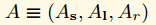 substate
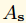 suicide set
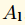 log series
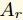 refund balance

! 트랜잭션 동안 사용 [이미지] 총 가스 (사진 / sign_gas_total.png).
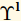 트랜잭션 로그가 생성.

! [이미지] (사진 / sign_i_a.png) 코드 소유자를 실행
! 주관자 [화상 (영상 / sign_i_o.png) 트랜잭션
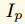 gasPrice
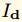 inputdata
! [영상] (사진 / sign_i_s.png) 원인 코드 실행 주소, 거래는 거래를 후원하는 경우
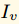 value
! 코드 [화상 (영상 / sign_i_b.png)가 실행될
! [이미지] (사진 / sign_i_h.png) 현재 헤더 영역
! [이미지] (사진 / sign_i_e.png) 현재 통화 깊이

! [화상 (영상 / sign_exec_model.png) 실행 모델의 실리사이드 세트; ** L ** O 출력 세트를 기록, R 환불

! [화상 (영상 / sign_exec_func.png)하는 기능을 수행

! [이미지] (사진 / sign_m_g.png) 현재 사용할 수있는 가스
! [이미지] (사진 / sign_u_pc.png) 프로그램 카운터
! [화상 (영상 / sign_u_m.png) 메모리 내용
! [이미지] 유효량 워드 (영상 / sign_u_i.png) 메모리
! [이미지] (사진 / sign_u_s.png) 스택 내용

실행되는 현재 나타내고 승! 명령 [화상 (영상 / sign_m_w.png)

! [이미지] 수 (영상 / sign_stack_removed.png) 명령어 스택 개체를 제거 할
! [이미지] 수 (사진 / sign_stack_added.png) 명령은 스택 오브젝트를 증가 필요