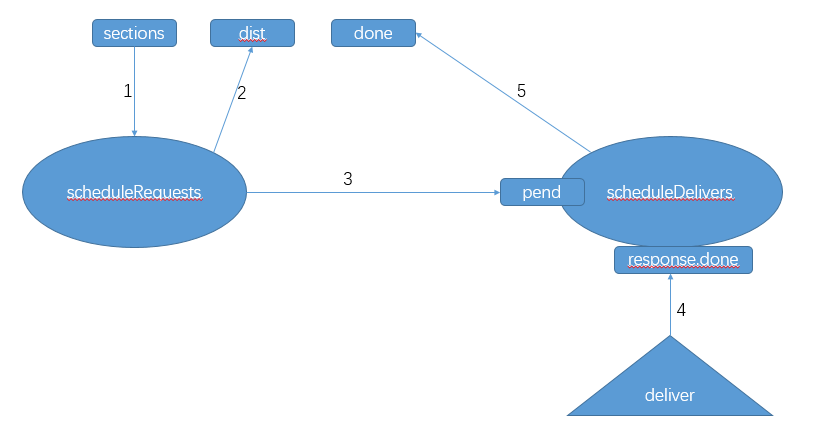
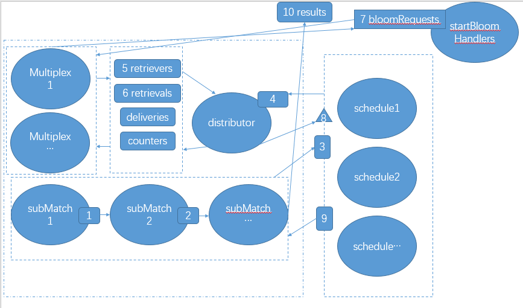

## scheduler.go

검색 일정 단일 비트 값에 기초하여 스케줄러 블룸 필터 부. 스케줄링 검색 작업 첨가 이외에, 이러한 구조는 최소의 비용으로 네트워크 / 데이터베이스 일 수있다 복잡한 필터의 경우에, 결과 중복 요청을 캐싱 할 수있다.

### 데이터 구조
검색 요청 작업은 꽃이고, 또는 우선적으로 네트워크에서 검색 할 로컬 데이터베이스에서 잘라. 섹션 비트 한 블룸 필터링 된의 검색 (2048 총)을 나타내고, 선분 참조 블록을, 각각의 블록 4096을 나타낸다. 이전 (ETH-bloombits 필터 및 소스 코드 분석 .md)에 도입했다.
	
	// request represents a bloom retrieval task to prioritize and pull from the local
	// database or remotely from the network.
	
	type request struct {
		section uint64 // Section index to retrieve the a bit-vector from
		bit	 uint   // Bit index within the section to retrieve the vector of
	}

응답 상태 요청은 현재 예정. 요청의 최종 상태는 응답 객체를 생성에 요청을 전송하지 않습니다.
이 섹션의 결과를 캐시 캐시.

	// response represents the state of a requested bit-vector through a scheduler.
	type response struct {
		cached []byte		// Cached bits to dedup multiple requests
		done   chan struct{} // Channel to allow waiting for completion
	}

scheduler

	// scheduler handles the scheduling of bloom-filter retrieval operations for
	// entire section-batches belonging to a single bloom bit. Beside scheduling the
	// retrieval operations, this struct also deduplicates the requests and caches
	// the results to minimize network/database overhead even in complex filtering
	// scenarios.
	type scheduler struct {
		bit	   uint			 블룸 필터의 비트의 // 색인이 스케줄러는 블룸 필터에 대한 책임이 어느 비트 (0-2047)
		responses map[uint64]*response //현재 계류중인 검색 요청 또는 이미 캐시 응답은 지속적으로 또는 캐시 된 결과를 요청합니다.
		lock	  sync.Mutex		   // Lock protecting the responses from concurrent access
	}

### 생성자
newScheduler 리셋 방법

	// newScheduler creates a new bloom-filter retrieval scheduler for a specific
	// bit index.
	func newScheduler(idx uint) *scheduler {
		return &scheduler{
			bit:	   idx,
			responses: make(map[uint64]*response),
		}
	}
	// reset cleans up any leftovers from previous runs. This is required before a
	// restart to ensure the no previously requested but never delivered state will
	// cause a lockup.
	어떤 및 이전의 모든 요청 정리의 사용을 다시 설정합니다.
	func (s *scheduler) reset() {
		s.lock.Lock()
		defer s.lock.Unlock()
	
		for section, res := range s.responses {
			if res.cached == nil {
				delete(s.responses, section)
			}
		}
	}

### 실행 실행 방법
실행 방법은, 수신 섹션 채널 섹션에서 요청하는 라인을 작성하는 순서 다 채널 요청에 대한 결과를 반환합니다. 동시 같은 스케줄러 실행이 가능하며,이 작업의 중복으로 이어질 것입니다.

	// run creates a retrieval pipeline, receiving section indexes from sections and
	// returning the results in the same order through the done channel. Concurrent
	// runs of the same scheduler are allowed, leading to retrieval task deduplication.
	func (s *scheduler) run(sections chan uint64, dist chan *request, done chan []byte, quit chan struct{}, wg *sync.WaitGroup) {
		//채널 섹션의이 유형은, 검색 할 수있는 채널 영역을 전송하기 위해 상기 입력 파라미터를 설계
		// dist 채널 타입, (로컬 검색 또는 통신 네트워크 일 수있다)에 포착 된 완료에 응답 한 후, 이러한 채널을 통해 요청을 전송하는 출력 채널에 속하는.
		//검색 결과 전달 채널에 대해 수행 채널은 반환 값으로 이해 될 수있다.
	
		// Create a forwarder channel between requests and responses of the same size as
		// the distribution channel (since that will block the pipeline anyway).
		(배관의 막힘 등) 트랜스 폰더 요청과 응답 사이의 통로와 같은 크기와 분포 채널 만들기
		pend := make(chan uint64, cap(dist))
	
		// Start the pipeline schedulers to forward between user -> distributor -> user
		wg.Add(2)
		go s.scheduleRequests(sections, dist, pend, quit, wg)
		go s.scheduleDeliveries(pend, done, quit, wg)
	}

### 스케줄러의 흐름도

도 타원은 goroutines을 나타냅니다. 사각형이 채널을 나타냅니다. 외부 삼각형 메서드 호출을 나타냅니다.

1. scheduleRequests는 goroutine 메시지 섹션에 섹션으로부터 수신
2. scheduleRequests 수신 섹션 송신 requtest DIST 채널로 조립하고, 오브젝트 응답 [부]를 구성 할
3. scheduleRequests는 대기열을 보류 부에 보낸다. scheduleDelivers 시원은 상기 대응되는 .done 차단 메시지를 수신 [이동 섹션]
REQUEST 요청 응답 [부] 4. 외부 호출을 전달하는 방법은, 결과가 기록이 seciton .cached. 닫고 반응 [부]되는 .done 채널
5. scheduleDelivers 응답 [부]되는 .done 정보를 수신. 반응 [부]을 보낼 완료 채널 .cached

### scheduleRequests
	
	// scheduleRequests reads section retrieval requests from the input channel,
	// deduplicates the stream and pushes unique retrieval tasks into the distribution
	// channel for a database or network layer to honour.
	func (s *scheduler) scheduleRequests(reqs chan uint64, dist chan *request, pend chan uint64, quit chan struct{}, wg *sync.WaitGroup) {
		// Clean up the goroutine and pipeline when done
		defer wg.Done()
		defer close(pend)
	
		// Keep reading and scheduling section requests
		for {
			select {
			case <-quit:
				return
	
			case section, ok := <-reqs:
				// New section retrieval requested
				if !ok {
					return
				}
				// Deduplicate retrieval requests
				unique := false
	
				s.lock.Lock()
				if s.responses[section] == nil {
					s.responses[section] = &response{
						done: make(chan struct{}),
					}
					unique = true
				}
				s.lock.Unlock()
	
				// Schedule the section for retrieval and notify the deliverer to expect this section
				if unique {
					select {
					case <-quit:
						return
					case dist <- &request{bit: s.bit, section: section}:
					}
				}
				select {
				case <-quit:
					return
				case pend <- section:
				}
			}
		}
	}

## generator.go
블룸 필터 구간 데이터에 기초하여 인덱스를 생성하기위한 오브젝트 생성기. 메인 발생기 내부 데이터 구조는 만개 [2048] [4096] 비트의 데이터 구조이다. 4096 개 header.logBloom 입력 데이터. [20] 제 20 헤더 logBloom 블룸 저장 등 [2,048 0]

데이터 구조 :

	// Generator takes a number of bloom filters and generates the rotated bloom bits
	// to be used for batched filtering.
	type Generator struct {
		blooms   [types.BloomBitLength][]byte // Rotated blooms for per-bit matching
		sections uint					 // 섹션 번호의 배치 함께 // 헤더 영역에 섹션 번호가 포함되어 있습니다. 기본값은 4096입니다
		nextBit  uint					 피어를 추가 할 때 피어를 추가 할 때 설정된 시간 // 다음 비트, 필요한 비트 위치가 설정 될
	}

건축 :

	// NewGenerator creates a rotated bloom generator that can iteratively fill a
	// batched bloom filter's bits.
	// 
	func NewGenerator(sections uint) (*Generator, error) {
		if sections%8 != 0 {
			return nil, errors.New("section count not multiple of 8")
		}
		b := &Generator{sections: sections}
		for i := 0; i < types.BloomBitLength; i++ { //BloomBitLength=2048
			b.blooms[i] = make([]byte, sections/8)  //바이트는 8 비트이기 때문에, 8로 나눈 것이있다
		}
		return b, nil
	}

AddBloom은의 logsBloom 헤더 영역을 증가

	// AddBloom takes a single bloom filter and sets the corresponding bit column
	// in memory accordingly.
	func (b *Generator) AddBloom(index uint, bloom types.Bloom) error {
		// Make sure we're not adding more bloom filters than our capacity
		if b.nextBit >= b.sections { //이 섹션의 최대 수를 초과
			return errSectionOutOfBounds
		}
		if b.nextBit != index {  //꽃 지수는 섹션의 인덱스
			return errors.New("bloom filter with unexpected index")
		}
		// Rotate the bloom and insert into our collection
		byteIndex := b.nextBit / 8  //해당 바이트를 찾아,이 바이트 위치를 설정해야
		bitMask := byte(1) << byte(7-b.nextBit%8) //비트를 찾기 바이트에서 인덱스의 값을 설정해야
	
		for i := 0; i < types.BloomBitLength; i++ {
			bloomByteIndex := types.BloomByteLength - 1 - i/8
			bloomBitMask := byte(1) << byte(i%8)
	
			if (bloom[bloomByteIndex] & bloomBitMask) != 0 {
				b.blooms[i][byteIndex] |= bitMask
			}
		}
		b.nextBit++
	
		return nil
	}

비트 세트 리턴

	// Bitset returns the bit vector belonging to the given bit index after all
	// blooms have been added.
	//모든 개화가 첨가되면, 비트 세트의 리턴 데이터는 주어진 인덱스에 속하는.
	func (b *Generator) Bitset(idx uint) ([]byte, error) {
		if b.nextBit != b.sections {
			return nil, errors.New("bloom not fully generated yet")
		}
		if idx >= b.sections {
			return nil, errSectionOutOfBounds
		}
		return b.blooms[idx], nil
	}
	

## matcher.go
정합은 파이프 라인 방식이며, 스케줄러 논리 매처는 데이터 콘텐츠를 확인할 수있는 가능성 블록을 생성하기 위해 이진 스트림 및 / 또는 비트 스트림의 동작을 수행한다.

데이터 구조
	
	// partialMatches with a non-nil vector represents a section in which some sub-
	// matchers have already found potential matches. Subsequent sub-matchers will
	// binary AND their matches with this vector. If vector is nil, it represents a
	// section to be processed by the first sub-matcher.
	//partialMatches은 부분 매치의 결과를 나타낸다. 필요 이러한 세 가지 조건 중 매칭 데이터를 찾는 동안 세 조건보다 ADDR1는 ADDR2, ADDR3을 여과한다. 그런 다음 우리는 경기가 파이프 라인의 세 가지 조건을 포함 시작합니다.
	//대조 결과의 첫 번째, 첫 번째 결과와 그 작업의 수행 결과 및 비트를 제공하고, 세 번째 과정 매칭의 결과로한다.
	type partialMatches struct {
		section uint64
		bitset  []byte
	}
	
	// Retrieval represents a request for retrieval task assignments for a given
	// bit with the given number of fetch elements, or a response for such a request.
	// It can also have the actual results set to be used as a delivery data struct.
	//블룸 필터 인덱스들의 블록 대표 검색을 검색, 오브젝트가 처리 startBloomHandlers 내부 ETH / bloombits.go로 전송되는, 방법은 Bitsets 내부에 배치 된 인덱스 블룸 필터 되돌아로부터로드한다.
	type Retrieval struct {
		Bit	  uint
		Sections []uint64
		Bitsets  [][]byte
	}
	
	// Matcher is a pipelined system of schedulers and logic matchers which perform
	// binary AND/OR operations on the bit-streams, creating a stream of potential
	// blocks to inspect for data content.
	type Matcher struct {
		sectionSize uint64 // Size of the data batches to filter on
	
		filters	[][]bloomIndexes	// Filter the system is matching for
		schedulers map[uint]*scheduler // Retrieval schedulers for loading bloom bits 
	
		retrievers chan chan uint   // 리트리버 프로세스는 전송 통로 검색 작업에 대한 비트 할당을 기다리고
		counters   chan chan uint   // 작업 카운트 보고서를 기다리고 리트리버 프로세스는 작업의 현재 수를 모두 반환
		retrievals chan chan *Retrieval //검색 작업을 전송하기위한 작업 할당을 기다리고 리트리버 프로세스에 할당
		deliveries chan *Retrieval  이 채널의 완료에 작업 응답 배달에 대한 검색 결과를 기다리고 // 리트리버 프로세스
	
		running uint32 // Atomic flag whether a session is live or not
	}

일반 이미지 플로우 정합은 타원 방식 goroutine를 나타낸다. 사각형 채널을 나타낸다. 삼각형은 메서드 호출을 나타냅니다.

1. 먼저 Matcher를는 수신 필터의 개수에 대응하는 개수에 따라 subMatch 만들었다. SubMatch 각 필터는 목적에 대응한다. 각 subMatch는 검색 결과에 검색 결과를 확인하고의 방법으로 새로운 위치 및 결과를 얻을 수 있습니다. 새로운 결과는 모든 비트 위치가 설정되어있는 경우이 다음 검색 결과에 전달됩니다. 이 요구 필터 모두의 결과를 얻기 위해 최단 경로 알고리즘이다. 이전의 계산은 아무것도 일치하지 않을 수 있다면, 그들은 아래 조건에 일치하지 않습니다.
일정 피사체 조성물의 개수에 대응하는 개수에 따라 2 Matcher를 시작할는 블룸 필터를 fiters.
3. subMatch는 해당 일정에 요청을 보냅니다.
4. 일정은 DIST에 대리점을 통해 전송 요청을 예약 대리점에서 관리합니다.
시작의 복수 후 (16) 다중 스레드 획득 대리점의 요청 및 대기열 bloomRequests에 요청을 보낼 수는 startBloomHandlers는 데이터베이스에 액세스하고 데이터 가져 오기 멀티 플렉스에 반환됩니다.
6. 다중 채널 배달 대리점에 의해 말 대답.
메소드 호출의 스케줄을 제공하는 제 분배기는 일람표에 결과를 보낸다
제 스케줄 결과 subMatch로 돌아갔다.
제 subMatch 다시 다음 submatch 계산 처리 결과를 전송한다. 마지막 subMatch 경우, 결과는 상기 채널로 전송되는 결과를 후 처리한다.

matcher

	filter := New(backend, 0, -1, []common.Address{addr}, [][]common.Hash{{hash1, hash2, hash3, hash4}}) 
	그룹 내의 관계 또는 그룹 간 관계. (번지 기능 &amp;&amp; hash1) || (ADDR &amp;&amp; hash2) || (ADDR &amp;&amp; hash3) || (ADDR &amp;&amp; hash4)
	

생성자는 특별한주의가 입력 매개 변수를 필터링입니다 필요합니다. 이 파라미터 bloomIndexes [] []의 3 차원 === 제 치수] [제 차원]의 어레이이다 [3].

	//이 filter.go 내부의 코드는이 매개 변수의 필터를 이해하는 데 유용합니다. filter.go는 Matcher를 호출합니다.
	
	//우리는 단지 한 위치를 차지 필터에 상관없이 얼마나 많은 주소를 것을 볼 수 있습니다. 필터 [0] = 주소
	//필터 [1] = 항목 [0] 항목 복수 =
	//필터 [2] = 항목 [1] 항목 복수 =
	//필터 [N]을 주제 = [N] 항목 복수 =

	//필터 파라미터 주소 및 필터링 알고리즘 항목이 (어느 하나 개의 어드레스의 어드레스를 포함 함) 및 (주제를 포함 [0]의 항목 내부에) 및 (주제를 포함 [. 1]있는 주제 중 하나) 및 (항목 [포함 N- ]) 어떤 주제 내부

	//필터의 구현을위한 데이터를 상기 제 볼 사이즈의 조작 데이터의 두번째 측정을 수행하거나 동작을 수행 할 수있다.
	
	//NewMatcher 방법에있어서, 소정의 입체 번째 위치 블룸 필터에 특정 데이터를 변환하는 방법. 따라서 [] [] 내부에 정규 VAR 필터 내부의 필터에서 [] [] [] 바이트 filter.go [3]
	
	func New(backend Backend, begin, end int64, addresses []common.Address, topics [][]common.Hash) *Filter {
		// Flatten the address and topic filter clauses into a single bloombits filter
		// system. Since the bloombits are not positional, nil topics are permitted,
		// which get flattened into a nil byte slice.
		var filters [][][]byte
		if len(addresses) > 0 {
			filter := make([][]byte, len(addresses))
			for i, address := range addresses {
				filter[i] = address.Bytes()
			}
			filters = append(filters, filter)
		}
		for _, topicList := range topics {
			filter := make([][]byte, len(topicList))
			for i, topic := range topicList {
				filter[i] = topic.Bytes()
			}
			filters = append(filters, filter)
		}

	// NewMatcher creates a new pipeline for retrieving bloom bit streams and doing
	// address and topic filtering on them. Setting a filter component to `nil` is
	// allowed and will result in that filter rule being skipped (OR 0x11...1).
	func NewMatcher(sectionSize uint64, filters [][][]byte) *Matcher {
		// Create the matcher instance
		m := &Matcher{
			sectionSize: sectionSize,
			schedulers:  make(map[uint]*scheduler),
			retrievers:  make(chan chan uint),
			counters:	make(chan chan uint),
			retrievals:  make(chan chan *Retrieval),
			deliveries:  make(chan *Retrieval),
		}
		// Calculate the bloom bit indexes for the groups we're interested in
		m.filters = nil
	
		for _, filter := range filters {
			// Gather the bit indexes of the filter rule, special casing the nil filter
			if len(filter) == 0 {
				continue
			}
			bloomBits := make([]bloomIndexes, len(filter))
			for i, clause := range filter {
				if clause == nil {
					bloomBits = nil
					break
				} 
				//제 치수의 입력에 대응하는 절 데이터, 어드레스 또는 주제 일 수있다
				//그 다음이 데이터는 여기 절 가능성 대응 세 블룸 필터가 1 인 경우, 인 블룸 필터의 인덱스 (0-2048)에 대응하는 세 개의 데이터를 산출 calcBloomIndexes .
				bloomBits[i] = calcBloomIndexes(clause)
			}
			// Accumulate the filter rules if no nil rule was within
			//bloomBits 한 계산에서 찾을 수있는 하나합니다. 그런 다음 전체 설립.
			if bloomBits != nil {
				//다른 bloomBits가 설정해야합니다, 전체 결과를 설정할 수 있습니다.
				m.filters = append(m.filters, bloomBits)
			}
		}
		// For every bit, create a scheduler to load/download the bit vectors
		for _, bloomIndexLists := range m.filters {
			for _, bloomIndexList := range bloomIndexLists {
				for _, bloomIndex := range bloomIndexList {
					//발생할 수있는 모든 표준에서. 우리는 해당 위치를 생성하는 스케줄러가
					//블룸 필터 데이터를 검색.
					m.addScheduler(bloomIndex)
				}
			}
		}
		return m
	}

시작 시작

	// Start starts the matching process and returns a stream of bloom matches in
	// a given range of blocks. If there are no more matches in the range, the result
	// channel is closed.
	func (m *Matcher) Start(begin, end uint64, results chan uint64) (*MatcherSession, error) {
		// Make sure we're not creating concurrent sessions
		if atomic.SwapUint32(&m.running, 1) == 1 {
			return nil, errors.New("matcher already running")
		}
		defer atomic.StoreUint32(&m.running, 0)
	
		// Initiate a new matching round
		//반환 값으로, 수명주기를 찾기 위해 관리 세션을 시작합니다.
		session := &MatcherSession{
			matcher: m,
			quit:	make(chan struct{}),
			kill:	make(chan struct{}),
		}
		for _, scheduler := range m.schedulers {
			scheduler.reset()
		}
		//이 작업은 파이프의 partialMatches 형 쿼리의 부분적인 결과를 반환하는 프로세스를 구축 할 것이다.
		sink := m.run(begin, end, cap(results), session)
	
		// Read the output from the result sink and deliver to the user
		session.pend.Add(1)
		go func() {
			defer session.pend.Done()
			defer close(results)
	
			for {
				select {
				case <-session.quit:
					return
	
				case res, ok := <-sink:
					// New match result found
					//반환 값은 블록이 비트 맵 값을 가질 수있는 구역 및 구역이므로 되돌리고 결과를 찾기
					//이 비트 맵을 통과하는 것이 필요하다 그래서, 그 블록을 찾기로 설정되어, 블록 번호가 다시 반환됩니다.
					if !ok {
						return
					}
					// Calculate the first and last blocks of the section
					sectionStart := res.section * m.sectionSize
	
					first := sectionStart
					if begin > first {
						first = begin
					}
					last := sectionStart + m.sectionSize - 1
					if end < last {
						last = end
					}
					// Iterate over all the blocks in the section and return the matching ones
					for i := first; i <= last; i++ {
						// Skip the entire byte if no matches are found inside
						next := res.bitset[(i-sectionStart)/8]
						if next == 0 {
							i += 7
							continue
						}
						// Some bit it set, do the actual submatching
						if bit := 7 - i%8; next&(1<<bit) != 0 {
							select {
							case <-session.quit:
								return
							case results <- i:
							}
						}
					}
				}
			}
		}()
		return session, nil
	}

실행 방법

	// run creates a daisy-chain of sub-matchers, one for the address set and one
	// for each topic set, each sub-matcher receiving a section only if the previous
	// ones have all found a potential match in one of the blocks of the section,
	// then binary AND-ing its own matches and forwaring the result to the next one.
	//블록의 부분에 이전 서브 블록에서 발견과 일치하는 모든 부분을 수신하는 경우 주소의 세트, 서브 정규 파이프 라인을 생성 항목들의 각 세트에 대해 하나가 각 서브 정합이에만 가능 다음 자신의 일치, 다음에 전달 결과를 받았다.
	// The method starts feeding the section indexes into the first sub-matcher on a
	// new goroutine and returns a sink channel receiving the results.

	상기 방법은 제 1 부 정합 유닛 부 인덱서를 시작하고, 상기 수신기의 결과가 수신 채널을 반환한다.
	func (m *Matcher) run(begin, end uint64, buffer int, session *MatcherSession) chan *partialMatches {
		// Create the source channel and feed section indexes into
		source := make(chan *partialMatches, buffer)
	
		session.pend.Add(1)
		go func() {
			defer session.pend.Done()
			defer close(source)
	
			for i := begin / m.sectionSize; i <= end/m.sectionSize; i++ {
				//제 1 입력 소스 subMatch, 나머지를 구성하는 루프에 대한 자신의 소스의 결과에 넣어 subMatch
				//이 소스의 비트 세트 필드가 정확히 일치하는 대신, 0xff가 있으며, 우리가 작업이 단계와 일치합니다,이 단계의 결과는 일치를 얻는 것입니다.
				select {
				case <-session.quit:
					return
				case source <- &partialMatches{i, bytes.Repeat([]byte{0xff}, int(m.sectionSize/8))}:
				}
			}
		}()
		// Assemble the daisy-chained filtering pipeline
		next := source
		dist := make(chan *request, buffer)
	
		for _, bloom := range m.filters {  //파이프 라인의 건설, 다음 입력 subMatch로 이전의 출력.
			next = m.subMatch(next, dist, bloom, session)
		}
		// Start the request distribution
		session.pend.Add(1)
		//유통 스레드를 시작합니다.
		go m.distributor(dist, session)
	
		return next
	}

subMatch 기능

	// subMatch creates a sub-matcher that filters for a set of addresses or topics, binary OR-s those matches, then
	// binary AND-s the result to the daisy-chain input (source) and forwards it to the daisy-chain output.
	// The matches of each address/topic are calculated by fetching the given sections of the three bloom bit indexes belonging to
	// that address/topic, and binary AND-ing those vectors together.
	//결과가 넣어 전달 불완전 비트의 결과가 비어있는 경우, 현재 위치와 상기 연산 결과의 결과로 여과 한 다음 이러한 비트 또는 비트 조작과의 주소 또는 주제, 토픽들의 세트를 필터링하기위한 서브 정합을 생성 subMatch 다음 서브 정규. 주소 / 타이틀 매칭 어드레스의 각 부분을 획득함으로써 계산된다 / 피사체 블룸 세 비트 인덱스는 이들 벡터의 부분과 이진 AND 부여와 함께 계산 필터.
	
	subMatch 가장 중요한 기능이다 필터 [] [] [3] 함께 동작 삼차원와 제 치수 및 제 차원 또는 중.

	func (m *Matcher) subMatch(source chan *partialMatches, dist chan *request, bloom []bloomIndexes, session *MatcherSession) chan *partialMatches {
		// Start the concurrent schedulers for each bit required by the bloom filter
		//수신 피어 [] bloomIndexes 번째 파라미터 삼차원 필터 [] [3]

		sectionSources := make([][3]chan uint64, len(bloom))
		sectionSinks := make([][3]chan []byte, len(bloom))
		for i, bits := range bloom { //나는 두 번째 차원의 수를 나타냅니다
			for j, bit := range bits {  //j는 첨자 블룸 필터 확실히 세 개의 값이다 (0-2048)를 나타낸다
				sectionSources[i][j] = make(chan uint64, cap(source)) //입력 채널 스케줄러 만들기
				sectionSinks[i][j] = make(chan []byte, cap(source)) //출력 채널 스케줄러 만들기
				//[I] [J] 송신부 필요성 sectionSources하여,이 비트에 대한 스케쥴링 요청을 시작,
				//수신 결과 sectionSinks [I] [J]
				//DIST는 스케줄러 요청 전송 채널입니다. 이 안에 도입 스케줄러를 가지고있다.
				m.schedulers[bit].run(sectionSources[i][j], dist, sectionSinks[i][j], session.quit, &session.pend)
			}
		}
	
		process := make(chan *partialMatches, cap(source)) //소스에서 항목을 인출 한 후 여기에 전달되는 중간 채널을 시작되었다
		results := make(chan *partialMatches, cap(source)) //반환 값 채널
	
		session.pend.Add(2)
		go func() {
			// Tear down the goroutine and terminate all source channels
			defer session.pend.Done()
			defer close(process)
	
			defer func() {
				for _, bloomSources := range sectionSources {
					for _, bitSource := range bloomSources {
						close(bitSource)
					}
				}
			}()
			// Read sections from the source channel and multiplex into all bit-schedulers
			//sectionSources 소스 채널 섹션에서 스케줄러로 전송 및 읽기 이러한 데이터
			for {
				select {
				case <-session.quit:
					return
	
				case subres, ok := <-source:
					// New subresult from previous link
					if !ok {
						return
					}
					// Multiplex the section index to all bit-schedulers
					for _, bloomSources := range sectionSources {
						for _, bitSource := range bloomSources {
							//위의 스케줄러의 모든 입력 채널에 전달했다. 이러한 적용
							//지정된 비트의 섹션을 찾을 수 있습니다. 그 결과 sectionSinks로 전송한다 [I] [J]
							select {
							case <-session.quit:
								return
							case bitSource <- subres.section:
							}
						}
					}
					// Notify the processor that this section will become available
					select {
					case <-session.quit:
						return
					case process <- subres: //모든 요청이 스케줄러에 제출 될 때까지 처리하는 메시지를 보냅니다.
					}
				}
			}
		}()
	
		go func() {
			// Tear down the goroutine and terminate the final sink channel
			defer session.pend.Done()
			defer close(results)
	
			// Read the source notifications and collect the delivered results
			for {
				select {
				case <-session.quit:
					return
	
				case subres, ok := <-process: 
					//문제가 있습니다. 그것은 순서가 가능하다. 채널 때문에 캐시가있다. 쿼리 속도가 주도했을 수 있습니다
					//구현 스케줄러의보기, 스케줄러는 순서를 보장하는 것입니다. 어떻게 나갈 방법을, 온다.
					// Notified of a section being retrieved
					if !ok {
						return
					}
					// Gather all the sub-results and merge them together
					var orVector []byte
					for _, bloomSinks := range sectionSinks {
						var andVector []byte
						for _, bitSink := range bloomSinks { //여기 세 값이 세 값의 동작과, 각 블룸 필터에 대응하는 목표 값을 나타내는 수신 할 수 있고,
						이 블록에 대응하는 값이있을 수 있음을 얻을 수있다.
							var data []byte
							select {
							case <-session.quit:
								return
							case data = <-bitSink:
							}
							if andVector == nil {
								andVector = make([]byte, int(m.sectionSize/8))
								copy(andVector, data)
							} else {
								bitutil.ANDBytes(andVector, andVector, data)
							}
						}
						orVector 경우 == 제 동작 {무 차원 데이터 또는 수행.
							orVector = andVector
						} else {
							bitutil.ORBytes(orVector, orVector, andVector)
						}
					}
	
					if orVector == nil { //채널 폐쇄 할 수있다. 의 값으로 어떤 쿼리 없다
						orVector = make([]byte, int(m.sectionSize/8))
					}
					if subres.bitset != nil {
						//입력 동작 시간 결과. 나는이 값의 시작은 모두 1로 초기화된다 기억
						bitutil.ANDBytes(orVector, orVector, subres.bitset)
					}
					if bitutil.TestBytes(orVector) { //만약 모든 제로는 결과에 추가됩니다. 다음 경기는 줄 수 있습니다. 또는 반환한다.
						select {
						case <-session.quit:
							return
						case results <- &partialMatches{subres.section, orVector}:
						}
					}
				}
			}
		}()
		return results
	}

유통, 스케줄러의 요청을 수락하고 세트 안에 넣어. 이러한 작업은 다음을 채우기 위해 리트리버에 할당됩니다.
	
	// distributor receives requests from the schedulers and queues them into a set
	// of pending requests, which are assigned to retrievers wanting to fulfil them.
	func (m *Matcher) distributor(dist chan *request, session *MatcherSession) {
		defer session.pend.Done()
	
		var (
			requests   = make(map[uint][]uint64) // Per-bit list of section requests, ordered by section number
			unallocs   = make(map[uint]struct{}) // Bits with pending requests but not allocated to any retriever
			retrievers chan chan uint			// Waiting retrievers (toggled to nil if unallocs is empty)
		)
		var (
			allocs   int			// Number of active allocations to handle graceful shutdown requests
			shutdown = session.quit // Shutdown request channel, will gracefully wait for pending requests
		)
	
		// assign is a helper method fo try to assign a pending bit an an actively
		// listening servicer, or schedule it up for later when one arrives.
		assign := func(bit uint) {
			select {
			case fetcher := <-m.retrievers:
				allocs++
				fetcher <- bit
			default:
				// No retrievers active, start listening for new ones
				retrievers = m.retrievers
				unallocs[bit] = struct{}{}
			}
		}
	
		for {
			select {
			case <-shutdown:
				// Graceful shutdown requested, wait until all pending requests are honoured
				if allocs == 0 {
					return
				}
				shutdown = nil
	
			case <-session.kill:
				// Pending requests not honoured in time, hard terminate
				return
	
			case req := <-dist: //내부 큐의 지정된 비트 위치로 전송 스케줄러 요청
				// New retrieval request arrived to be distributed to some fetcher process
				queue := requests[req.bit]
				index := sort.Search(len(queue), func(i int) bool { return queue[i] >= req.section })
				requests[req.bit] = append(queue[:index], append([]uint64{req.section}, queue[index:]...)...)
	
				// If it's a new bit and we have waiting fetchers, allocate to them
				//이 비트는 새 경우. 아직 할당되지 않은, 우리는에는 Fetcher를 기다리는 그를 지정
				if len(queue) == 0 {
					assign(req.bit)
				}
	
			case fetcher := <-retrievers:
				// New retriever arrived, find the lowest section-ed bit to assign
				//새로운 리트리버가 들어올 경우 작업이 할당되지 않은 경우, 우리는 참조
				bit, best := uint(0), uint64(math.MaxUint64)
				for idx := range unallocs {
					if requests[idx][0] < best {
						bit, best = idx, requests[idx][0]
					}
				}
				// Stop tracking this bit (and alloc notifications if no more work is available)
				delete(unallocs, bit)
				if len(unallocs) == 0 { //경우 모든 작업이 할당됩니다. 그래서 팔로 잉 언 팔로우 리트리버
					retrievers = nil
				}
				allocs++
				fetcher <- bit
	
			case fetcher := <-m.counters:
				// New task count request arrives, return number of items
				//새로운 요청에, 액세스 요청의 지정된 비트의 수.
				fetcher <- uint(len(requests[<-fetcher]))
	
			case fetcher := <-m.retrievals:
				// New fetcher waiting for tasks to retrieve, assign
				//누군가가 작업을받을 수 있습니다.
				task := <-fetcher
				if want := len(task.Sections); want >= len(requests[task.Bit]) {
					task.Sections = requests[task.Bit]
					delete(requests, task.Bit)
				} else {
					task.Sections = append(task.Sections[:0], requests[task.Bit][:want]...)
					requests[task.Bit] = append(requests[task.Bit][:0], requests[task.Bit][want:]...)
				}
				fetcher <- task
	
				// If anything was left unallocated, try to assign to someone else
				//이 경우에는 작업 배정이 완료되지 않습니다. 시도는 다른 사람에게 할당합니다.
				if len(requests[task.Bit]) > 0 {
					assign(task.Bit)
				}
	
			case result := <-m.deliveries:
				// New retrieval task response from fetcher, split out missing sections and
				// deliver complete ones
				//우리는 작업의 결과를 받았다.
				var (
					sections = make([]uint64, 0, len(result.Sections))
					bitsets  = make([][]byte, 0, len(result.Bitsets))
					missing  = make([]uint64, 0, len(result.Sections))
				)
				for i, bitset := range result.Bitsets {
					if len(bitset) == 0 { //작업 결과가없는 경우 기록
						missing = append(missing, result.Sections[i])
						continue
					}
					sections = append(sections, result.Sections[i])
					bitsets = append(bitsets, bitset)
				}
				//결과를 제공
				m.schedulers[result.Bit].deliver(sections, bitsets)
				allocs--
	
				// Reschedule missing sections and allocate bit if newly available
				if len(missing) > 0 { //이 누락 된 경우, 새로운 작업을 다시 생성합니다.
					queue := requests[result.Bit]
					for _, section := range missing {
						index := sort.Search(len(queue), func(i int) bool { return queue[i] >= section })
						queue = append(queue[:index], append([]uint64{section}, queue[index:]...)...)
					}
					requests[result.Bit] = queue
	
					if len(queue) == len(missing) {
						assign(result.Bit)
					}
				}
				// If we're in the process of shutting down, terminate
				if allocs == 0 && shutdown == nil {
					return
				}
			}
		}
	}

작업은 AllocateRetrieval을받을 수 있습니다. 작업은 작업을받을 수 있습니다. 이 검색 작업의 지정된 비트를 반환합니다.

	// AllocateRetrieval assigns a bloom bit index to a client process that can either
	// immediately reuest and fetch the section contents assigned to this bit or wait
	// a little while for more sections to be requested.
	func (s *MatcherSession) AllocateRetrieval() (uint, bool) {
		fetcher := make(chan uint)
	
		select {
		case <-s.quit:
			return 0, false
		case s.matcher.retrievers <- fetcher:
			bit, ok := <-fetcher
			return bit, ok
		}
	}

AllocateSections이 섹션의 비트를 지정된 조회 작업을받을 수 있습니다.

	// AllocateSections assigns all or part of an already allocated bit-task queue
	// to the requesting process.
	func (s *MatcherSession) AllocateSections(bit uint, count int) []uint64 {
		fetcher := make(chan *Retrieval)
	
		select {
		case <-s.quit:
			return nil
		case s.matcher.retrievals <- fetcher:
			task := &Retrieval{
				Bit:	  bit,
				Sections: make([]uint64, count),
			}
			fetcher <- task
			return (<-fetcher).Sections
		}
	}

DeliverSections는, 결과는 배달 채널에 전달했다.

	// DeliverSections delivers a batch of section bit-vectors for a specific bloom
	// bit index to be injected into the processing pipeline.
	func (s *MatcherSession) DeliverSections(bit uint, sections []uint64, bitsets [][]byte) {
		select {
		case <-s.kill:
			return
		case s.matcher.deliveries <- &Retrieval{Bit: bit, Sections: sections, Bitsets: bitsets}:
		}
	}

멀티 플렉스가 작업을 수행, 멀티 플렉스 기능은 작업, bloomRequest 큐에 전달되는 작업을받을 수 계속했다. 큐 결과를 얻기. 그리고 대리점에 전달했다. 전체 프로세스를 완료합니다.

	// Multiplex polls the matcher session for rerieval tasks and multiplexes it into
	// the reuested retrieval queue to be serviced together with other sessions.
	//
	// This method will block for the lifetime of the session. Even after termination
	// of the session, any request in-flight need to be responded to! Empty responses
	// are fine though in that case.
	func (s *MatcherSession) Multiplex(batch int, wait time.Duration, mux chan chan *Retrieval) {
		for {
			// Allocate a new bloom bit index to retrieve data for, stopping when done
			bit, ok := s.AllocateRetrieval()
			if !ok {
				return
			}
			// Bit allocated, throttle a bit if we're below our batch limit
			if s.PendingSections(bit) < batch {
				select {
				case <-s.quit:
					// Session terminating, we can't meaningfully service, abort
					s.AllocateSections(bit, 0)
					s.DeliverSections(bit, []uint64{}, [][]byte{})
					return
	
				case <-time.After(wait):
					// Throttling up, fetch whatever's available
				}
			}
			// Allocate as much as we can handle and request servicing
			sections := s.AllocateSections(bit, batch)
			request := make(chan *Retrieval)
	
			select {
			case <-s.quit:
				// Session terminating, we can't meaningfully service, abort
				s.DeliverSections(bit, sections, make([][]byte, len(sections)))
				return
	
			case mux <- request:
				// Retrieval accepted, something must arrive before we're aborting
				request <- &Retrieval{Bit: bit, Sections: sections}
	
				result := <-request
				s.DeliverSections(result.Bit, result.Sections, result.Bitsets)
			}
		}
	}

