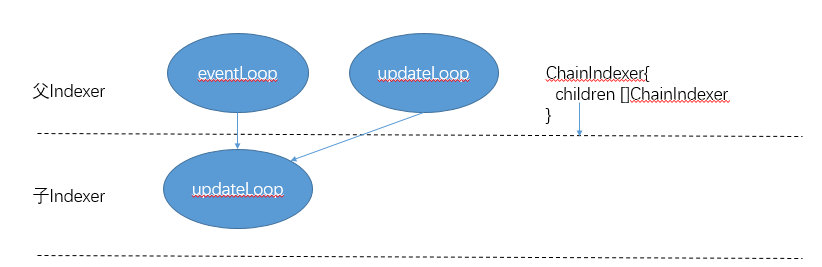

## chain_indexer 블록 사슬 인덱스

chain_indexer.go 소스 분석

이름이 암시 chain_indexer은 기능 블록 체인 인덱스를 생성하는데 사용된다. BloomIndexer 특별한 구현 chain_indexer 사실 파생 클래스로 알 수있는 사실이다 BloomIndexer 기능을 도입 ETH 협정 전에있는 주요 기능은 그것 chain_indexer을 달성했다. 이 파생 클래스이지만, 그러나 사실 만 chain_indexer의 BloomIndexer을 사용. 블룸 필터는 신속하게 사용자 로그 검색 기능에 대응하기 위해, 인덱스를 만들 체인을 차단하는 것입니다. 여기에 코드의이 부분을 분석 할 수 있습니다.

### 데이터 구조

	// ChainIndexerBackend defines the methods needed to process chain segments in
	// the background and write the segment results into the database. These can be
	// used to create filter blooms or CHTs.
	//ChainIndexerBackend 처리 블록 사슬의 단편에있어서, 상기 데이터베이스에 상기 처리 결과를 정의한다. 블룸 필터를 만들거나 CHTs하는 데 사용할 수 있습니다.
	//BloomIndexer은 실제로 그것이 무엇인지 모르는 여기이 인터페이스 ChainIndexerBackend CHTs를 구현합니다.
	type ChainIndexerBackend interface {
		// Reset initiates the processing of a new chain segment, potentially terminating
		// any partially completed operations (in case of a reorg).
		//재설정 방법은 어떤 작업이 완료되지 않고 종료 할 수 새로운 블록 사슬 단편을 초기화하는 데 사용된다.
		Reset(section uint64)
	
		// Process crunches through the next header in the chain segment. The caller
		// will ensure a sequential order of headers.
		//블록 체인의 다음 세그먼트의 헤더 영역은 처리된다. 호출자는 헤더 영역의 연속 순서를 보장합니다.
		Process(header *types.Header)
	
		// Commit finalizes the section metadata and stores it into the database.
		完成区块链片段的元数据并将其存储到数据库中。
		Commit() error
	}
	
	// ChainIndexer does a post-processing job for equally sized sections of the
	// canonical chain (like BlooomBits and CHT structures). A ChainIndexer is
	// connected to the blockchain through the event system by starting a
	// ChainEventLoop in a goroutine.
	//단편의 동일한 크기의 블록 ChainIndexer 체인. 체인 ChainEventLoop 방법과 통신 이벤트 시스템 블록을 통해 ChainIndexer,
	// Further child ChainIndexers can be added which use the output of the parent
	// section indexer. These child indexers receive new head notifications only
	// after an entire section has been finished or in case of rollbacks that might
	// affect already finished sections.
	//당신은 더 하위 체인 인덱서의 부모의 섹션 인덱스를 사용하여 추가적인 출력을 추가 할 수 있습니다. 전용 만 전체 또는 롤백의 완성 부분의 가능한 영향 부의 완료 후 하위 체인 인덱서 헤드의 경우 새로운 통지를 수신한다.

	type ChainIndexer struct {
		chainDb  ethdb.Database  // 체인 데이터베이스 데이터베이스 여기서 인덱스로 블록 사슬의 데이터
		indexDb  ethdb.Database  // DB를 접두사의 테이블 뷰는 인덱스 스토리지로 인덱스 메타 데이터를 쓰고
		backend  ChainIndexerBackend //후단의 인덱스를 생성하기 위해 상기 인덱스 데이터의 콘텐츠를 생성하는 배경 프로세서.
		children []*ChainIndexer	 // Child indexers to cascade chain updates to서브 인덱스
	
		active uint32		  // Flag whether the event loop was started
		update chan struct{}   //헤더는 상기 수신 된 헤더에 처리되어야 알림 채널
		quit   chan chan error // Quit channel to tear down running goroutines
	
		sectionSize uint64 // Number of blocks in a single chain segment to process섹션의 크기입니다. 기본값은 4096 개 블록 섹션입니다
		confirmsReq uint64 //확인 과정의 종료 부분을 처리하기 전에 이전의 확정 번호 세그먼트 수를 완료
	
		storedSections uint64 //섹션의 수는 성공적으로 성공적으로 데이터베이스 부분의 수에 색인 데이터베이스에 색인
		knownSections  uint64 //부분의 수에 공지 섹션 번호 (현명한 블록 689)를 완료하기 위해 완전
		cascadedHead   uint64 //마지막 완료 부분의 블록 번호를 완료하는 마지막 서브 블록 번호 부분의 인덱스를 연접 subindexers 케스케이드
	
		throttling time.Duration //디스크는 많은 자원을 업그레이드 상당한 방지하기 위해 자원 디스크 제한을 독차지에서 무거운 업그레이드를 방지하기 위해 조절
	
		log  log.Logger
		lock sync.RWMutex
	}

생성자 NewChainIndexer,

	이 방법은 호출되는이 ETH / bloombits.go에
	const (
		// bloomConfirms is the number of confirmation blocks before a bloom section is
		// considered probably final and its rotated bits are calculated.
		//너무 많은 후 블록의 수, 블록 표현을 확인하는 데 사용 bloomConfirms은 꽃 부분은 변경되지 않은 것으로 추정된다.
		bloomConfirms = 256
	
		// bloomThrottling is the time to wait between processing two consecutive index
		// sections. It's useful during chain upgrades to prevent disk overload.
		//bloomThrottling 두 개의 연속 처리 지연 사이 세그먼트 인덱스이다. 블록 체인 업그레이드 프로세스가 유용 디스크 과부하를 방지합니다.
		bloomThrottling = 100 * time.Millisecond
	)
	
	func NewBloomIndexer(db ethdb.Database, size uint64) *core.ChainIndexer {
		backend := &BloomIndexer{
			db:   db,
			size: size,
		}
		//당신은 indexDb을 볼 수 있고 chainDb 실제로 동일한 데이터베이스이지만, BloomBitsIndexPrefix의 각 키 indexDb 추가 접두사 앞에있다.
		table := ethdb.NewTable(db, string(core.BloomBitsIndexPrefix))
	
		return core.NewChainIndexer(db, table, backend, size, bloomConfirms, bloomThrottling, "bloombits")
	}

	// NewChainIndexer creates a new chain indexer to do background processing on
	// chain segments of a given size after certain number of confirmations passed.
	// The throttling parameter might be used to prevent database thrashing.

	func NewChainIndexer(chainDb, indexDb ethdb.Database, backend ChainIndexerBackend, section, confirm uint64, throttling time.Duration, kind string) *ChainIndexer {
		c := &ChainIndexer{
			chainDb:	 chainDb,
			indexDb:	 indexDb,
			backend:	 backend,
			update:	  make(chan struct{}, 1),
			quit:		make(chan chan error),
			sectionSize: section,
			confirmsReq: confirm,
			throttling:  throttling,
			log:		 log.New("type", kind),
		}
		// Initialize database dependent fields and start the updater
		c.loadValidSections()
		go c.updateLoop()
	
		return c
	}

우리가 내부 데이터베이스에서 정보를 처리하기 전에로드하는 데 사용 loadValidSections는 storedSections 우리는 우리가 어디를 처리 할 필요가 있다는 것을 의미한다.

	// loadValidSections reads the number of valid sections from the index database
	// and caches is into the local state.
	func (c *ChainIndexer) loadValidSections() {
		data, _ := c.indexDb.Get([]byte("count"))
		if len(data) == 8 {
			c.storedSections = binary.BigEndian.Uint64(data[:])
		}
	}
	

updateLoop 상기 블록 사슬 부분을 처리하는 백엔드를 호출 할 수 있고, 메인 이벤트 루프이며, 이것은 마스터 인덱스 노드 및 모든 자식 인덱서는 모두이 goroutine 방법을 시작할 것이라는 점에 유의해야한다.
	
	func (c *ChainIndexer) updateLoop() {
		var (
			updating bool
			updated  time.Time
		)
		for {
			select {
			case errc := <-c.quit:
				// Chain indexer terminating, report no failure and abort
				errc <- nil
				return
	
			case <-c.update:  //백엔드 프로세싱을 요구하는 경우, 상기 다른 채널 goroutine에 메시지를 보낸다
				// Section headers completed (or rolled back), update the index
				c.lock.Lock()
				if c.knownSections > c.storedSections { //현재 알려진 이미 저장된 섹션 섹션에서보다 큰 경우
					// Periodically print an upgrade log message to the user
					//일단 매 8 초 인쇄 정보를 기록합니다.
					if time.Since(updated) > 8*time.Second {
						if c.knownSections > c.storedSections+1 {
							updating = true
							c.log.Info("Upgrading chain index", "percentage", c.storedSections*100/c.knownSections)
						}
						updated = time.Now()
					}
					// Cache the current section count and head to allow unlocking the mutex
					section := c.storedSections
					var oldHead common.Hash
					if section > 0 { //섹션 - 1 대표 섹션 첨자 0에서 시작됩니다.
						//sectionHead는 섹션의 마지막 블록의 해시 값을 획득하기 위해 사용된다.
						oldHead = c.sectionHead(section - 1)
					}
					// Process the newly defined section in the background
					c.lock.Unlock()
					//해시 값 처리의 마지막 블록의 새로운 부분을 반환
					newHead, err := c.processSection(section, oldHead)
					if err != nil {
						c.log.Error("Section processing failed", "error", err)
					}
					c.lock.Lock()
	
					// If processing succeeded and no reorgs occcurred, mark the section completed
					if err == nil && oldHead == c.sectionHead(section-1) {
						c.setSectionHead(section, newHead) //데이터베이스 상태를 업데이트
						c.setValidSections(section + 1)데이터베이스 상태를 업데이트 //
						if c.storedSections == c.knownSections && updating {
							updating = false
							c.log.Info("Finished upgrading chain index")
						}
						//cascadedHead 업데이트 마지막 블록 섹션의 높이
						//무슨 소용입니까?
						c.cascadedHead = c.storedSections*c.sectionSize - 1
						for _, child := range c.children {
							c.log.Trace("Cascading chain index update", "head", c.cascadedHead)
							child.newHead(c.cascadedHead, false)
						}
					} else { //프로세스가 실패하면 새 알림 전에 다시 시도하지 않는있다.
						// If processing failed, don't retry until further notification
						c.log.Debug("Chain index processing failed", "section", section, "err", err)
						c.knownSections = c.storedSections
					}
				}
				// If there are still further sections to process, reschedule
				//섹션 처리 대기가있는 경우, 다음 처리하는 조절 시간을 기다립니다. 디스크 과부하를 피하십시오.
				if c.knownSections > c.storedSections {
					time.AfterFunc(c.throttling, func() {
						select {
						case c.update <- struct{}{}:
						default:
						}
					})
				}
				c.lock.Unlock()
			}
		}
	}

방법을 시작합니다. 계약은 ETH 시작했을 때이 메소드가 불려,이 방법은 이벤트가 가입, 당신은 가입자 정보 변경 블록 체인을 얻을 수있다, 현재의 영역은 헤더이고, 두 개의 매개 변수를 사용합니다.

	eth.bloomIndexer.Start(eth.blockchain.CurrentHeader(), eth.blockchain.SubscribeChainEvent)

	// Start creates a goroutine to feed chain head events into the indexer for
	// cascading background processing. Children do not need to be started, they
	// are notified about new events by their parents.

	//체인 활성화 할 필요가 없습니다. 그들의 부모는 그들에게 통보됩니다.
	func (c *ChainIndexer) Start(currentHeader *types.Header, chainEventer func(ch chan<- ChainEvent) event.Subscription) {
		go c.eventLoop(currentHeader, chainEventer)
	}

	// eventLoop is a secondary - optional - event loop of the indexer which is only
	// started for the outermost indexer to push chain head events into a processing
	// queue.

	//eventLoop 사이클은 가장 바깥쪽에있는 아이 노드에 호출됩니다. 모든 자식 인덱서는이 방법을 시작되지 않습니다.

	func (c *ChainIndexer) eventLoop(currentHeader *types.Header, chainEventer func(ch chan<- ChainEvent) event.Subscription) {
		// Mark the chain indexer as active, requiring an additional teardown
		atomic.StoreUint32(&c.active, 1)
	
		events := make(chan ChainEvent, 10)
		sub := chainEventer(events)
		defer sub.Unsubscribe()
	
		// Fire the initial new head event to start any outstanding processing
		//사실, 우리는 작업 전에 미완성 실행하는 데 사용되는 블록의 높이를 설정합니다.
		c.newHead(currentHeader.Number.Uint64(), false)
	
		var (
			prevHeader = currentHeader
			prevHash   = currentHeader.Hash()
		)
		for {
			select {
			case errc := <-c.quit:
				// Chain indexer terminating, report no failure and abort
				errc <- nil
				return
	
			case ev, ok := <-events:
				// Received a new event, ensure it's not nil (closing) and update
				if !ok {
					errc := <-c.quit
					errc <- nil
					return
				}
				header := ev.Block.Header()
				if header.ParentHash != prevHash { //다음, 우리는 먼저 포크가있는 경우
					//공통의 조상이 재건 될 필요가 후 인덱스에서, 공통 조상을 찾을 수 있습니다.
					c.newHead(FindCommonAncestor(c.chainDb, prevHeader, header).Number.Uint64(), true)
				}
				//새로운 머리를 설정
				c.newHead(header.Number.Uint64(), false)
	
				prevHeader, prevHash = header, header.Hash()
			}
		}
	}

newHead있어서, 새로운 통지 인덱서 블록 사슬 헤드 또는 인덱스 newHead 방법 화재를 재구성 할 필요

	
	// newHead notifies the indexer about new chain heads and/or reorgs.
	func (c *ChainIndexer) newHead(head uint64, reorg bool) {
		c.lock.Lock()
		defer c.lock.Unlock()
	
		// If a reorg happened, invalidate all sections until that point
		if reorg { //모든 부분은 다시 작성해야합니다 헤드 처음부터 인덱스를 다시 작성해야합니다.
			// Revert the known section number to the reorg point
			changed := head / c.sectionSize
			if changed < c.knownSections {
				c.knownSections = changed
			}
			// Revert the stored sections from the database to the reorg point
			//데이터베이스에서 저장된 부분적인 복구는 인덱스 포인트를 다시
			if changed < c.storedSections {
				c.setValidSections(changed)
			}
			// Update the new head number to te finalized section end and notify children
			//새로운 머리를 생성하고 모든 하위 지수를 통지
			head = changed * c.sectionSize
	
			if head < c.cascadedHead {
				c.cascadedHead = head
				for _, child := range c.children {
					child.newHead(c.cascadedHead, true)
				}
			}
			return
		}
		// No reorg, calculate the number of newly known sections and update if high enough
		var sections uint64
		if head >= c.confirmsReq {
			sections = (head + 1 - c.confirmsReq) / c.sectionSize
			if sections > c.knownSections {
				c.knownSections = sections
	
				select {
				case c.update <- struct{}{}:
				default:
				}
			}
		}
	}

인덱스 데이터 간의 부모 - 자식 관계
아버지 인덱서 부하 모니터 이벤트 및 처리하는 newHead 인덱서 아이가 updateLoop하는 결과를 전달합니다.

setValidSections 방법은 섹션의 쓰기 현재 번호가 저장되어있다. 입력 값이 다수가 기억 된 것보다 작 으면, 내부 데이터베이스에서 대응하는 부분을 삭제

	// setValidSections writes the number of valid sections to the index database
	func (c *ChainIndexer) setValidSections(sections uint64) {
		// Set the current number of valid sections in the database
		var data [8]byte
		binary.BigEndian.PutUint64(data[:], sections)
		c.indexDb.Put([]byte("count"), data[:])
	
		// Remove any reorged sections, caching the valids in the mean time
		for c.storedSections > sections {
			c.storedSections--
			c.removeSectionHead(c.storedSections)
		}
		c.storedSections = sections // needed if new > old
	}

processSection
	
	// processSection processes an entire section by calling backend functions while
	// ensuring the continuity of the passed headers. Since the chain mutex is not
	// held while processing, the continuity can be broken by a long reorg, in which
	// case the function returns with an error.

	//헤더 파일의 전송의 연속성을 보장하면서 전체 후단 부분을 처리하는 함수를 호출하여 processSection. 링크 뮤텍스가 프로세스에서 개최되지 않기 때문에 연속성이 경우, 함수는 오류를 반환, 다시 중단 될 수 있습니다.
	func (c *ChainIndexer) processSection(section uint64, lastHead common.Hash) (common.Hash, error) {
		c.log.Trace("Processing new chain section", "section", section)
	
		// Reset and partial processing
		c.backend.Reset(section)
	
		for number := section * c.sectionSize; number < (section+1)*c.sectionSize; number++ {
			hash := GetCanonicalHash(c.chainDb, number)
			if hash == (common.Hash{}) {
				return common.Hash{}, fmt.Errorf("canonical block #%d unknown", number)
			}
			header := GetHeader(c.chainDb, hash, number)
			if header == nil {
				common.Hash {} fmt.Errorf 복귀 ( &quot;블록 # 1 %의 D를 [% X ...]을 찾을 수 없습니다&quot;번호, 해시 [4])
			} else if header.ParentHash != lastHead {
				return common.Hash{}, fmt.Errorf("chain reorged during section processing")
			}
			c.backend.Process(header)
			lastHead = header.Hash()
		}
		if err := c.backend.Commit(); err != nil {
			c.log.Error("Section commit failed", "error", err)
			return common.Hash{}, err
		}
		return lastHead, nil
	}
