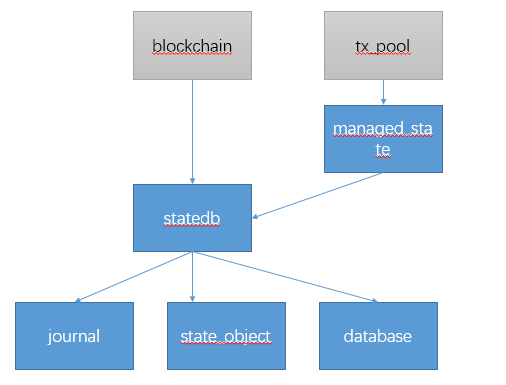

코어 / 상태 패킷 버퍼 층은 중심 층 (캐시)를 트라이 에테르 스퀘어 상태를 제공한다

도 다음 메인 스테이트의 구조.

청색 사각형은 본 모듈은 회색 사각형 외부 모듈을 나타냄.

- 데이터베이스가 주로 트라이의 추상화를 제공, 캐싱을 제공하고 계약 트라이 트리의 코드 길이를 캐시합니다.
- 저널은 주요 로깅 작동 및 롤백 기능의 작동을 제공합니다.
- state_object 계정, 추상 객체 일부 기능 계정을 제공합니다.
- statedb은 주로 상태가 일부 기능을 트라이 제공합니다.

## database.go
database.go는 데이터베이스의 추상화를 제공한다.

데이터 구조
	
	// Database wraps access to tries and contract code.
	type Database interface {
		// Accessing tries:
		// OpenTrie opens the main account trie.
		// OpenStorageTrie opens the storage trie of an account.
		//트라이의 주요 계좌를 개설 OpenTrie
		//OpenStorageTrie 스토리지 트라이의 계좌를 개설
		OpenTrie(root common.Hash) (Trie, error)
		OpenStorageTrie(addrHash, root common.Hash) (Trie, error)
		// Accessing contract code:
		//액세스 계약 코드
		ContractCode(addrHash, codeHash common.Hash) ([]byte, error)
		//계약의 크기에 액세스 할 수 있습니다. 이러한 접근 방식은 종종 호출 할 수 있습니다. 캐시 때문입니다.
		ContractCodeSize(addrHash, codeHash common.Hash) (int, error)
		// CopyTrie returns an independent copy of the given trie.
		//지정된 트라이의 독립적 인 복사본으로 돌아 CopyTrie
		CopyTrie(Trie) Trie
	}
	
	// NewDatabase creates a backing store for state. The returned database is safe for
	// concurrent use and retains cached trie nodes in memory.
	func NewDatabase(db ethdb.Database) Database {
		csc, _ := lru.New(codeSizeCacheSize)
		return &cachingDB{db: db, codeSizeCache: csc}
	}
	
	type cachingDB struct {
		db			ethdb.Database
		mu			sync.Mutex
		pastTries [] * Trie.SecureTrie // 트라이 트리 캐시
		codeSizeCache *lru.Cache	  캐시 // 계약 코드 크기
	}

OpenTrie, 내부 캐시에서. 당신이 반환되면 트라이의 캐시 된 복사본을 찾거나 나무를 다시 돌아갑니다.

	
	func (db *cachingDB) OpenTrie(root common.Hash) (Trie, error) {
		db.mu.Lock()
		defer db.mu.Unlock()
	
		for i := len(db.pastTries) - 1; i >= 0; i-- {
			if db.pastTries[i].Hash() == root {
				return cachedTrie{db.pastTries[i].Copy(), db}, nil
			}
		}
		tr, err := trie.NewSecure(root, db.db, MaxTrieCacheGen)
		if err != nil {
			return nil, err
		}
		return cachedTrie{tr, db}, nil
	}

	func (db *cachingDB) OpenStorageTrie(addrHash, root common.Hash) (Trie, error) {
		return trie.NewSecure(root, db.db, 0)
	}

ContractCode 및 ContractCodeSize, ContractCodeSize 캐시를 가지고있다.

	
	func (db *cachingDB) ContractCode(addrHash, codeHash common.Hash) ([]byte, error) {
		code, err := db.db.Get(codeHash[:])
		if err == nil {
			db.codeSizeCache.Add(codeHash, len(code))
		}
		return code, err
	}
	
	func (db *cachingDB) ContractCodeSize(addrHash, codeHash common.Hash) (int, error) {
		if cached, ok := db.codeSizeCache.Get(codeHash); ok {
			return cached.(int), nil
		}
		code, err := db.ContractCode(addrHash, codeHash)
		if err == nil {
			db.codeSizeCache.Add(codeHash, len(code))
		}
		return len(code), err
	}

cachedTrie 구조와 방법은 트리는 캐시 전에 방법이 pushTrie를 호출 할 때, 커밋 커밋.

	// cachedTrie inserts its trie into a cachingDB on commit.
	type cachedTrie struct {
		*trie.SecureTrie
		db *cachingDB
	}
	
	func (m cachedTrie) CommitTo(dbw trie.DatabaseWriter) (common.Hash, error) {
		root, err := m.SecureTrie.CommitTo(dbw)
		if err == nil {
			m.db.pushTrie(m.SecureTrie)
		}
		return root, err
	}
	func (db *cachingDB) pushTrie(t *trie.SecureTrie) {
		db.mu.Lock()
		defer db.mu.Unlock()
	
		if len(db.pastTries) >= maxPastTries {
			copy(db.pastTries, db.pastTries[1:])
			db.pastTries[len(db.pastTries)-1] = t
		} else {
			db.pastTries = append(db.pastTries, t)
		}
	}

## journal.go
그것은 운영 저널 로그를 나타내며,이를 통해 다양한 작업을 위해 해당 로그 롤백 기능을 제공합니다. 당신은 트랜잭션 로그의 유형에 따라 일부 작업을 수행 할 수 있습니다.

이 인터페이스는 기능을 취소 제공 journalEntry 유형 정의는 정의합니다. 저널은 journalEntry의 목록입니다.

	type journalEntry interface {
		undo(*StateDB)
	}
	
	type journal []journalEntry
	

로그의 다양한 형태와 방법을 취소합니다.

	createObjectChange struct {  //로그 객체를 생성합니다. 방법을 실행 취소하는 것은 StateDB에서 생성 된 개체를 제거하는 것입니다.
		account *common.Address
	}
	func (ch createObjectChange) undo(s *StateDB) {
		delete(s.stateObjects, *ch.account)
		delete(s.stateObjectsDirty, *ch.account)
	}
	//변형 stateObject 들어, 방법은 원래의 객체의 값을 변경하는 취소.
	resetObjectChange struct {
		prev *stateObject
	}
	func (ch resetObjectChange) undo(s *StateDB) {
		s.setStateObject(ch.prev)
	}
	//자살을 변경합니다. 자살 계정을 삭제해야합니다,하지만 당신은이 기술을 커밋하지 않는 경우, 개체가 stateDB에서 제거되지 않았습니다.
	suicideChange struct {
		account	 *common.Address
		prev		bool // whether account had already suicided
		prevbalance *big.Int
	}
	func (ch suicideChange) undo(s *StateDB) {
		obj := s.getStateObject(*ch.account)
		if obj != nil {
			obj.suicided = ch.prev
			obj.setBalance(ch.prevbalance)
		}
	}

	// Changes to individual accounts.
	balanceChange struct {
		account *common.Address
		prev	*big.Int
	}
	nonceChange struct {
		account *common.Address
		prev	uint64
	}
	storageChange struct {
		account	   *common.Address
		key, prevalue common.Hash
	}
	codeChange struct {
		account			*common.Address
		prevcode, prevhash []byte
	}
	
	func (ch balanceChange) undo(s *StateDB) {
		s.getStateObject(*ch.account).setBalance(ch.prev)
	}
	func (ch nonceChange) undo(s *StateDB) {
		s.getStateObject(*ch.account).setNonce(ch.prev)
	}
	func (ch codeChange) undo(s *StateDB) {
		s.getStateObject(*ch.account).setCode(common.BytesToHash(ch.prevhash), ch.prevcode)
	}
	func (ch storageChange) undo(s *StateDB) {
		s.getStateObject(*ch.account).setState(ch.key, ch.prevalue)
	}

	//나의 이해는 환불이 DAO 이벤트를 처리한다는 것입니다
	refundChange struct {
		prev *big.Int
	}
	func (ch refundChange) undo(s *StateDB) {
		s.refund = ch.prev
	}
	//추가 로그인 변경
	addLogChange struct {
		txhash common.Hash
	}
	func (ch addLogChange) undo(s *StateDB) {
		logs := s.logs[ch.txhash]
		if len(logs) == 1 {
			delete(s.logs, ch.txhash)
		} else {
			s.logs[ch.txhash] = logs[:len(logs)-1]
		}
		s.logSize--
	}
	//이것은 원래 SHA3 바이트 [] SHA3 해시 증가 볼 VM 증가한다 -&gt; 바이트 []의 대응 관계
	addPreimageChange struct {
		hash common.Hash
	}
	func (ch addPreimageChange) undo(s *StateDB) {
		delete(s.preimages, ch.hash)
	}

	touchChange struct {
		account   *common.Address
		prev	  bool
		prevDirty bool
	}
	var ripemd = common.HexToAddress("0000000000000000000000000000000000000003")
	func (ch touchChange) undo(s *StateDB) {
		if !ch.prev && *ch.account != ripemd {
			s.getStateObject(*ch.account).touched = ch.prev
			if !ch.prevDirty {
				delete(s.stateObjectsDirty, *ch.account)
			}
		}
	}

## state_object.go
stateObject는 이더넷을 스퀘어 계정을 수정했다.

데이터 구조

	type Storage map[common.Hash]common.Hash
	
	// stateObject represents an Ethereum account which is being modified.
	//stateObject는 이더넷을 스퀘어 계정을 수정했다.
	// The usage pattern is as follows:
	// First you need to obtain a state object.
	// Account values can be accessed and modified through the object.
	// Finally, call CommitTrie to write the modified storage trie into a database.

	다음과 같이 사용 모드는 다음과 같습니다
	먼저 당신은 state_object를 얻을 필요가있다.
	계정 값은 액세스와 객체에 의해 수정 될 수 있습니다.
	마지막으로, CommitTrie 저장 트라이 수정 데이터베이스에 기록 호출합니다.

	type stateObject struct {
		address  common.Address
		addrHash common.Hash //계정의 해시 값의 에테 리움 주소의 해시 이더넷 주소 스퀘어 계정
		data 계정 //이 실제 이더넷 광장 계정에 대한 정보입니다
		db   * StateDB // 상태 데이터베이스
	
		// DB error.
		// State objects are used by the consensus core and VM which are
		// unable to deal with database-level errors. Any error that occurs
		// during a database read is memoized here and will eventually be returned
		// by StateDB.Commit.
		// 
		데이터베이스 오류.
		stateObject 코어와는 내부 코드는 데이터베이스 수준 오류를 처리 할 수있는 VM 컨센서스 알고리즘에 의해 사용됩니다.
		여기에 저장되는 데이터베이스 읽기 중에 발생하는 모든 오류는 궁극적으로 돌아 StateDB.Commit 것입니다.
		dbErr error
	
		//캐시를 작성합니다. 쓰기 캐시
		trie Trie //처음 액세스에 대한 사용자의 저장 트라이 nil이 아닌됩니다 저장 트라이은 첫 번째 방문시 비어가된다
		code Code //로드 코드가 제공 될 때 코드 계약 코드를로드 할 때 설정됩니다 계약 바이트 코드,
	
		cachedStorage Storage //중복을 피하기 위해 스토리지 항목 캐시 오브젝트 기억 사용자 버퍼를 판독하고, 판독 반복 피해야
		dirtyStorage  Storage //디스크에 플러시 할 필요가 저장 항목은 사용자의 디스크 스토리지 객체로 브러시 필요
	
		//캐시 플래그. 캐시 마크
		// When an object is marked suicided it will be delete from the trie
		// during the "update" phase of the state transition.
		//객체가 자살로 표시 될 때,이 단계에서 트리에서 삭제 전환 &quot;갱신&quot;의 상태가됩니다.
		dirtyCode bool //코드가 업데이트되면 코드가 업데이트 된 경우는 true, true로 설정
		suicided  bool
		touched   bool
		deleted   bool
		onDirty   func(addr common.Address) //상태를 표시하는 방법은 콜백이 호출되는 시간으로 설정된다 drity 처음 새롭게 더러운 개체.
	}

	// Account is the Ethereum consensus representation of accounts.
	// These objects are stored in the main account trie.
	//이더넷은 광장의 합의가 표시되는 계정입니다. 이러한 개체는 트라이 기본 계정에 저장됩니다.
	type Account struct {
		Nonce	uint64
		Balance  *big.Int
		Root	 common.Hash // merkle root of the storage trie
		CodeHash []byte
	}

생성자

	// newObject creates a state object.
	func newObject(db *StateDB, address common.Address, data Account, onDirty func(addr common.Address)) *stateObject {
		if data.Balance == nil {
			data.Balance = new(big.Int)
		}
		if data.CodeHash == nil {
			data.CodeHash = emptyCodeHash
		}
		return &stateObject{
			db:			db,
			address:	   address,
			addrHash:	  crypto.Keccak256Hash(address[:]),
			data:		  data,
			cachedStorage: make(Storage),
			dirtyStorage:  make(Storage),
			onDirty:	   onDirty,
		}
	}

RLP 인코딩, 그냥 계정 개체를 인코딩.

	// EncodeRLP implements rlp.Encoder.
	func (c *stateObject) EncodeRLP(w io.Writer) error {
		return rlp.Encode(w, c.data)
	}

일부 국가의 기능을 변경.
	
	func (self *stateObject) markSuicided() {
		self.suicided = true
		if self.onDirty != nil {
			self.onDirty(self.Address())
			self.onDirty = nil
		}
	}

	func (c *stateObject) touch() {
		c.db.journal = append(c.db.journal, touchChange{
			account:   &c.address,
			prev:	  c.touched,
			prevDirty: c.onDirty == nil,
		})
		if c.onDirty != nil {
			c.onDirty(c.Address())
			c.onDirty = nil
		}
		c.touched = true
	}
	

보관 처리

	//getTrie 스토리지 트리는 계정을 반환
	func (c *stateObject) getTrie(db Database) Trie {
		if c.trie == nil {
			var err error
			c.trie, err = db.OpenStorageTrie(c.addrHash, c.data.Root)
			if err != nil {
				c.trie, _ = db.OpenStorageTrie(c.addrHash, common.Hash{})
				c.setError(fmt.Errorf("can't create storage trie: %v", err))
			}
		}
		return c.trie
	}
	
	// GetState returns a value in account storage.
	//다시 GetState 계정 저장소가이 유형의 값이 해시의 유형, 값을 반환합니다.
	//해시 값을 저장할 수 설명 계정 저장?
	//경우 캐시는 내부 데이터베이스에서 다른 쿼리 캐시에서 그 안에 존재한다. 그리고 내부의 캐시에 저장됩니다.
	func (self *stateObject) GetState(db Database, key common.Hash) common.Hash {
		value, exists := self.cachedStorage[key]
		if exists {
			return value
		}
		// Load from DB in case it is missing.
		enc, err := self.getTrie(db).TryGet(key[:])
		if err != nil {
			self.setError(err)
			return common.Hash{}
		}
		if len(enc) > 0 {
			_, content, _, err := rlp.Split(enc)
			if err != nil {
				self.setError(err)
			}
			value.SetBytes(content)
		}
		if (value != common.Hash{}) {
			self.cachedStorage[key] = value
		}
		return value
	}
	
	// SetState updates a value in account storage.
	//해시 유형을 키 값 유형의 값을하는 설정 storeage 계정합니다.
	func (self *stateObject) SetState(db Database, key, value common.Hash) {
		self.db.journal = append(self.db.journal, storageChange{
			account:  &self.address,
			key:	  key,
			prevalue: self.GetState(db, key),
		})
		self.setState(key, value)
	}
	
	func (self *stateObject) setState(key, value common.Hash) {
		self.cachedStorage[key] = value
		self.dirtyStorage[key] = value
	
		if self.onDirty != nil {
			self.onDirty(self.Address())
			self.onDirty = nil
		}
	}

커밋 제출

	// CommitTrie the storage trie of the object to dwb.
	// This updates the trie root.
	//처음 공개 한 후 수정 한 다음 커밋 또는 롤백 단계,
	func (self *stateObject) CommitTrie(db Database, dbw trie.DatabaseWriter) error {
		self.updateTrie(db) //수정 된 캐시가 트리는 기록 updateTrie
		if self.dbErr != nil {
			return self.dbErr
		}
		root, err := self.trie.CommitTo(dbw)
		if err == nil {
			self.data.Root = root
		}
		return err
	}

	// updateTrie writes cached storage modifications into the object's storage trie.
	func (self *stateObject) updateTrie(db Database) Trie {
		tr := self.getTrie(db)
		for key, value := range self.dirtyStorage {
			delete(self.dirtyStorage, key)
			if (value == common.Hash{}) {
				self.setError(tr.TryDelete(key[:]))
				continue
			}
			// Encoding []byte cannot fail, ok to ignore the error.
			v, _ := rlp.EncodeToBytes(bytes.TrimLeft(value[:], "\x00"))
			self.setError(tr.TryUpdate(key[:], v))
		}
		return tr
	}
	
	// UpdateRoot sets the trie root to the current root hash of
	//루트 계정은 현재 트라이 트리로 설정됩니다.
	func (self *stateObject) updateRoot(db Database) {
		self.updateTrie(db)
		self.data.Root = self.trie.Hash()
	}
	

일부 추가 기능은 deepCopy는 state_object의 깊은 사본을 제공합니다.
	
	
	func (self *stateObject) deepCopy(db *StateDB, onDirty func(addr common.Address)) *stateObject {
		stateObject := newObject(db, self.address, self.data, onDirty)
		if self.trie != nil {
			stateObject.trie = db.db.CopyTrie(self.trie)
		}
		stateObject.code = self.code
		stateObject.dirtyStorage = self.dirtyStorage.Copy()
		stateObject.cachedStorage = self.dirtyStorage.Copy()
		stateObject.suicided = self.suicided
		stateObject.dirtyCode = self.dirtyCode
		stateObject.deleted = self.deleted
		return stateObject
	}

## statedb.go

stateDB 광장 이더넷은 MERKLE 트라이에 모든 콘텐츠를 저장하는 데 사용됩니다. 캐싱 및 저장 중첩 상태에 대한 책임을 StateDB. 이 계약과 계정을 검색하는 일반 쿼리 인터페이스입니다 :

데이터 구조

	type StateDB struct {
		db   Database  //백 엔드 데이터베이스
		trie Trie   // 트라이 트리의 주요 계정 트라이
	
		// This map holds 'live' objects, which will get modified while processing a state transition.
		//다음의지도가 될 때 상태 전이를 수정 될 현재 활성화 된 오브젝트를 저장하는데 사용된다.
		//캐시 개체에 사용 stateObjects
		//stateObjectsDirty 캐시 개체에 수정되었습니다.
		stateObjects	  map[common.Address]*stateObject
		stateObjectsDirty map[common.Address]struct{}
	
		// DB error.
		// State objects are used by the consensus core and VM which are
		// unable to deal with database-level errors. Any error that occurs
		// during a database read is memoized here and will eventually be returned
		// by StateDB.Commit.
		dbErr error
	
		// The refund counter, also used by state transitioning.
		//카운터를 환불. 그러나 알 수없는 함수.
		refund *big.Int
	
		thash, bhash common.Hash  //현재의 트랜잭션 (transaction) 해시 및 블록 해시
		txIndex	  int	  인덱스 // 현재 트랜잭션
		logs	 맵 [common.Hash] * // types.Log 로그 트랜잭션 키의 해시 값은
		logSize	  uint
	
		preimages map[common.Hash][]byte  //EVM 계산 SHA3-&gt; 바이트 [] 매핑 관계
	
		// Journal of state modifications. This is the backbone of
		// Snapshot and RevertToSnapshot.
		//상태 변경 로그. 이 스냅 샷과 RevertToSnapshot의 중추입니다.
		journal		journal
		validRevisions []revision
		nextRevisionId int
	
		lock sync.Mutex
	}

생성자

	//일반 사용 statedb, _ = state.New (common.Hash {}, state.NewDatabase (dB))
	
	// Create a new state from a given trie
	func New(root common.Hash, db Database) (*StateDB, error) {
		tr, err := db.OpenTrie(root)
		if err != nil {
			return nil, err
		}
		return &StateDB{
			db:				db,
			trie:			  tr,
			stateObjects:	  make(map[common.Address]*stateObject),
			stateObjectsDirty: make(map[common.Address]struct{}),
			refund:			new(big.Int),
			logs:			  make(map[common.Hash][]*types.Log),
			preimages:		 make(map[common.Hash][]byte),
		}, nil
	}

### 로그의 치료를 위해
로그인이 실제로 처리 상태 로그는 다음의 몇 가지 기능에 따라 사용 구비 상기 트리는 상태로 저장된 블록 사슬에 저장되지 때문에, 처리 상태를 제공 놀라운이 비교 로그. 이상한 것은이 일시적으로 제거하지 않을 경우 더 축적하는 것이 더해야한다, 로그를 제거하는 방법에 대한 내부 정보를 볼 수 없습니다. TODO 로그 삭제

기능을 준비, 그것은 트랜잭션 실행에서 실행되기 시작했다.

AddLog 기능, VM는 트랜잭션을 실행하는 동안 실행됩니다. 로그를 추가합니다. 관련 트랜잭션 로그 동안 최대 트랜잭션의 정보 부분을 추가합니다.

GetLogs 기능, 트랜잭션이 제거 완료됩니다.

	// Prepare sets the current transaction hash and index and block hash which is
	// used when the EVM emits new state logs.
	func (self *StateDB) Prepare(thash, bhash common.Hash, ti int) {
		self.thash = thash
		self.bhash = bhash
		self.txIndex = ti
	}
	
	func (self *StateDB) AddLog(log *types.Log) {
		self.journal = append(self.journal, addLogChange{txhash: self.thash})
	
		log.TxHash = self.thash
		log.BlockHash = self.bhash
		log.TxIndex = uint(self.txIndex)
		log.Index = self.logSize
		self.logs[self.thash] = append(self.logs[self.thash], log)
		self.logSize++
	}
	func (self *StateDB) GetLogs(hash common.Hash) []*types.Log {
		return self.logs[hash]
	}
	
	func (self *StateDB) Logs() []*types.Log {
		var logs []*types.Log
		for _, lgs := range self.logs {
			logs = append(logs, lgs...)
		}
		return logs
	}

### stateObject 처리
getStateObject 먼저 트라이 나무에서 거기에 도착하지 않을 경우, 캐시에서 구 캐시에로드.
	
	// Retrieve a state object given my the address. Returns nil if not found.
	func (self *StateDB) getStateObject(addr common.Address) (stateObject *stateObject) {
		// Prefer 'live' objects.
		if obj := self.stateObjects[addr]; obj != nil {
			if obj.deleted {
				return nil
			}
			return obj
		}
	
		// Load the object from the database.
		enc, err := self.trie.TryGet(addr[:])
		if len(enc) == 0 {
			self.setError(err)
			return nil
		}
		var data Account
		if err := rlp.DecodeBytes(enc, &data); err != nil {
			log.Error("Failed to decode state object", "addr", addr, "err", err)
			return nil
		}
		// Insert into the live set.
		obj := newObject(self, addr, data, self.MarkStateObjectDirty)
		self.setStateObject(obj)
		return obj
	}

MarkStateObjectDirty는 더러운에 stateObject을 설정합니다. 직접 빈 구조에 대응하는 어드레스에 StateObjectDirty.

	// MarkStateObjectDirty adds the specified object to the dirty map to avoid costly
	// state object cache iteration to find a handful of modified ones.
	func (self *StateDB) MarkStateObjectDirty(addr common.Address) {
		self.stateObjectsDirty[addr] = struct{}{}
	}

### 스냅 샷 및 롤백 기능
Snapshot可以创建一个快照， 然后通过다시 상태로 롤백 할 수 RevertToSnapshot,이 기능은 저널을 통해 수행 할 수 있습니다. 수정의 모든 단계는 실행 취소 로그 내부에 저널을 추가하는 것입니다. 롤백해야하는 경우에만 줄에 실행 취소 로그를 실행해야합니다.
	
	// Snapshot returns an identifier for the current revision of the state.
	func (self *StateDB) Snapshot() int {
		id := self.nextRevisionId
		self.nextRevisionId++
		self.validRevisions = append(self.validRevisions, revision{id, len(self.journal)})
		return id
	}
	
	// RevertToSnapshot reverts all state changes made since the given revision.
	func (self *StateDB) RevertToSnapshot(revid int) {
		// Find the snapshot in the stack of valid snapshots.
		idx := sort.Search(len(self.validRevisions), func(i int) bool {
			return self.validRevisions[i].id >= revid
		})
		if idx == len(self.validRevisions) || self.validRevisions[idx].id != revid {
			panic(fmt.Errorf("revision id %v cannot be reverted", revid))
		}
		snapshot := self.validRevisions[idx].journalIndex
	
		// Replay the journal to undo changes.
		for i := len(self.journal) - 1; i >= snapshot; i-- {
			self.journal[i].undo(self)
		}
		self.journal = self.journal[:snapshot]
	
		// Remove invalidated snapshots from the stack.
		self.validRevisions = self.validRevisions[:idx]
	}

### 루트 해시 상태의 중간 값을 획득
IntermediateRoot 현재 상태 트라이의 루트의 해시 값을 계산하는 데 사용됩니다. 이 메소드는 트랜잭션을 실행하는 동안이라고합니다. 그것은 거래 영수증에 저장됩니다

마무리 방법은 업데이트 방법은 트라이 데이터베이스 내부의 수정 레이어를 작성하기 위해 캐시에 저장 될 호출합니다. 하지만 시간이 아직 기본 데이터베이스에 기록되지 않았습니다. 아니 파일 할 땅이 없다, 데이터 메모리가 아직 커밋 호출합니다.
	
	// Finalise finalises the state by removing the self destructed objects
	// and clears the journal as well as the refunds.
	func (s *StateDB) Finalise(deleteEmptyObjects bool) {
		for addr := range s.stateObjectsDirty {
			stateObject := s.stateObjects[addr]
			if stateObject.suicided || (deleteEmptyObjects && stateObject.empty()) {
				s.deleteStateObject(stateObject)
			} else {
				stateObject.updateRoot(s.db)
				s.updateStateObject(stateObject)
			}
		}
		// Invalidate journal because reverting across transactions is not allowed.
		s.clearJournalAndRefund()
	}
	
	// IntermediateRoot computes the current root hash of the state trie.
	// It is called in between transactions to get the root hash that
	// goes into transaction receipts.
	func (s *StateDB) IntermediateRoot(deleteEmptyObjects bool) common.Hash {
		s.Finalise(deleteEmptyObjects)
		return s.trie.Hash()
	}

### 방법을 커밋
CommitTo는 변경 사항을 적용하는 데 사용됩니다.
	
	// CommitTo writes the state to the given database.
	func (s *StateDB) CommitTo(dbw trie.DatabaseWriter, deleteEmptyObjects bool) (root common.Hash, err error) {
		defer s.clearJournalAndRefund()
	
		// Commit objects to the trie.
		for addr, stateObject := range s.stateObjects {
			_, isDirty := s.stateObjectsDirty[addr]
			switch {
			case stateObject.suicided || (isDirty && deleteEmptyObjects && stateObject.empty()):
				// If the object has been removed, don't bother syncing it
				// and just mark it for deletion in the trie.
				s.deleteStateObject(stateObject)
			case isDirty:
				// Write any contract code associated with the state object
				if stateObject.code != nil && stateObject.dirtyCode {
					if err := dbw.Put(stateObject.CodeHash(), stateObject.code); err != nil {
						return common.Hash{}, err
					}
					stateObject.dirtyCode = false
				}
				// Write any storage changes in the state object to its storage trie.
				if err := stateObject.CommitTrie(s.db, dbw); err != nil {
					return common.Hash{}, err
				}
				// Update the object in the main account trie.
				s.updateStateObject(stateObject)
			}
			delete(s.stateObjectsDirty, addr)
		}
		// Write trie changes.
		root, err = s.trie.CommitTo(dbw)
		log.Debug("Trie cache stats after commit", "misses", trie.CacheMisses(), "unloads", trie.CacheUnloads())
		return root, err
	}

### 개요
상태 패키지는 사용자 상태 관리 및 계약 기능을 제공합니다. 다양한 상태 및 상태 계약 전환의 관리. 캐시, 트라이, 데이터베이스. 로깅 및 롤백 기능을 제공합니다.

