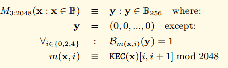

## 에테르 광장 블룸 필터

광장 지역 이더넷 헤더의 logsBloom라는 영역이 포함되어 있습니다. 이 영역은 현재 블룸 필터 블록은 모든 영수증 2048 비트의 합계를 기록 저장한다. 즉 256 바이트입니다.

그리고 기록을 많이 포함하는 거래의 우리의 영수증. 각 로그 기록은 계약의 주소, 많은 주제를 포함한다. 그리고 또한 우리의 영수증에서 블룸 필터가, 블룸 필터는 정보 로깅을 모두 기록합니다.

우리는 로깅 옐로우 북 공식적인 정의 내부를 보면.

O는 우리의 로깅, 주제 오아 대표 로거 주소, 오토, OT1이 로그를 대신하여, 외경이 나타내는 시간을 나타냅니다.

OA 기기 구약 32 바이트, OD 많은 바이트, 20 바이트

우리는 256 바이트로 기록 해시 객체를 변환하는 블룸 필터 함수를 정의 M

M3 : 2,045 특별한 함수, 비트 2048 비트를 설정하기 위해 사용되는 세 가지이다. 구체적인 방법은 다음 식을 참조.

모든 입력 값에 대한 출력 KEC 세 값을 얻는다 [4,5]이 값의 일부는 2048 모듈로 먼저 다음 KEC의 출력 [0,1] [2,3]을 취하여 물어, 이들 세 값은 2,048 인덱스를 출력하도록 설정해야한다. 그 다음 세 개의 값의 대상에 해당하는 경우, 그 다음이 블록에 확실히 아니다 모두 1 없으며, 어떠한 입력된다. 되면, 대응하는 3 개의 1이있는 경우,이 블록에서 설명되지 않아야한다. 이것은 블룸 필터의 특성이다.

블룸 필터는 모든 블룸 필터의 영수증 및 로그의 출력 설정에 있습니다.

시간대가 logBloom에서 헤더, 그것은 노동 조합의 모든 영수증의 블룸 필터입니다.

## ChainIndexer 및 BloomIndexer
대부분은 확실히 어떤 기능을 이해하지, ChainIndexer을보고 시작합니다. 사실, 당신은 이름에서 볼 수 있으며, 체인 인덱스입니다. 우리는 ETH BloomIndexer에서 본, 이는 블룸 필터 인덱스입니다.

로그는 우리의 계약에 지정된 함수를 찾을 수 있습니다.

사용자는 지정된 주제에 따라 필터링 할 주소 필터링을 지정 계약 주소에 따라 다음과 같은 매개 변수, 블록 번호의 끝을 전달하여 지정된 로그, 블록 번호의 시작을 찾을 수 있습니다.

	// FilterCriteria represents a request to create a new filter.
	type FilterCriteria struct {
		FromBlock *big.Int
		ToBlock   *big.Int
		Addresses []common.Address
		Topics	[][]common.Hash
	}

시작과 끝 사이의 간격이 큰 경우, 각 영역의 경우 logBloom 헤더 영역을 취득하는 직접 순서는 비교적 비효율적이다. 각각의 헤더 영역이 별도로 저장되기 때문에 임의 디스크 액세스를 많이해야 할 수도 있습니다.

그래서 광장 이더넷 프로토콜은 프로세스의 속도를하는 데 사용되는 로컬 인덱스는 유지합니다.

일반 원칙 예. 각 블록은 함께 저장된 logBloom 내부 4096 절, 장이라고 부른다. 각 섹션에 대한 2 차원 데이터 A [2048] [4096]에 저장된다. 2048 제 차원 블룸 필터 길이를 2048 바이트를 나타낸다. 4천96초 치수는 각각 순서대로 타일의 위치를 ​​나타내며, 구역 안에서 모든 블록을 나타낸다.

- A[0][0]=blockchain[section*4096+0].logBloom[0],
- A[0][1]=blockchain[section*4096+1].logBloom[0],
- A[0][4096]=blockchain[section*4096+1].logBloom[0],
- A[1][0]=blockchain[section*4096+0].logBloom[1],
- A[1][1024]=blockchain[section*4096+1024].logBloom[1],
- A[2047][1]=blockchain[section*4096+1].logBloom[2047],

제 충전이 완료되면, 그것은 2048 KV에 기록됩니다.

## bloombit.go 코드 분석

우리는 그 혼자 코드를 보면 조금 의아해 마음을 느끼는 경우는 인터페이스의 수를 구현하므로이 코드는, 상대적으로 매우 독립적이지, 특정 처리 로직은 여기가 아니라 내부의 핵심이다. 그러나 여기 내가 먼저 앞서 언급 한 결합 된 정보를 분석 할 수 있습니다. 코어 로직 코드의 후속 상세한 더 자세한 분석의 분석.

서비스 스레드 startBloomHandlers,이 지정된 섹션 비트에 쿼리에서 주어진 특정 쿼리 요청에 대한 응답에 반환 내부 levelDB. 조금 의아해 여기 혼자. 이 메서드를 호출하면 더 복잡하다. 그 중 대부분은 핵심 로직을 포함한다. 여기에 처음으로 정교하지. 라인에이 방법까지.

	type Retrieval struct {
		Bit	  uint		// 비트 값은 중 하나 싶어 0-2047 값을 표시
		Sections []uint64	// 그 절
		Bitsets  [][]byte	// 반환 값은 결과를 확인하십시오.
	}
	// startBloomHandlers starts a batch of goroutines to accept bloom bit database
	// retrievals from possibly a range of filters and serving the data to satisfy.
	func (eth *Ethereum) startBloomHandlers() {
		for i := 0; i < bloomServiceThreads; i++ {
			go func() {
				for {
					select {
					case <-eth.shutdownChan:
						return
	
					case request := <-eth.bloomRequests: //요청은 채널 인
						task := <-request //채널 내부에서 작업을 얻기
	
						task.Bitsets = make([][]byte, len(task.Sections))
						for i, section := range task.Sections {
							head := core.GetCanonicalHash(eth.chainDb, (section+1)*params.BloomBitsBlocks-1)
							blob, err := bitutil.DecompressBytes(core.GetBloomBits(eth.chainDb, task.Bit, section, head), int(params.BloomBitsBlocks)/8)
							if err != nil {
								panic(err)
							}
							task.Bitsets[i] = blob
						}
						request <- task //요청 채널을 통해 결과를 반환
					}
				}
			}()
		}
	}

### 데이터 구조
프로세스 BloomIndexer은 주로 몇 필요한 인터페이스를 달성, 인덱스, 인터페이스 core.ChainIndexer를 구축하는 사용자를 대상으로. 인덱스를 생성하는 로직은 내부에 여전히 core.ChainIndexer입니다.

	
	// BloomIndexer implements a core.ChainIndexer, building up a rotated bloom bits index
	// for the Ethereum header bloom filters, permitting blazing fast filtering.
	type BloomIndexer struct {
		size uint64 // section size to generate bloombits for
	
		db  ethdb.Database	   // database instance to write index data and metadata into
		gen *bloombits.Generator // generator to rotate the bloom bits crating the bloom index
	
		section uint64  // 섹션은 섹션 번호가 현재 처리중인 현재 구간
		head	common.Hash // Head is the hash of the last header processed
	}

	// NewBloomIndexer returns a chain indexer that generates bloom bits data for the
	// canonical chain for fast logs filtering.
	func NewBloomIndexer(db ethdb.Database, size uint64) *core.ChainIndexer {
		backend := &BloomIndexer{
			db:   db,
			size: size,
		}
		table := ethdb.NewTable(db, string(core.BloomBitsIndexPrefix))
	
		return core.NewChainIndexer(db, table, backend, size, bloomConfirms, bloomThrottling, "bloombits")
	}

재설정하는 방법의 ChainIndexerBackend를 구현하고, 새로운 섹션을 시작

	// Reset implements core.ChainIndexerBackend, starting a new bloombits index
	// section.
	func (b *BloomIndexer) Reset(section uint64) {
		gen, err := bloombits.NewGenerator(uint(b.size))
		if err != nil {
			panic(err)
		}
		b.gen, b.section, b.head = gen, section, common.Hash{}
	}

프로세스 ChainIndexerBackend는, 인덱스 헤더에 새로운 영역을 추가 실현
	
	// Process implements core.ChainIndexerBackend, adding a new header's bloom into
	// the index.
	func (b *BloomIndexer) Process(header *types.Header) {
		b.gen.AddBloom(uint(header.Number.Uint64()-b.section*b.size), header.Bloom)
		b.head = header.Hash()
	}

방법 ChainIndexerBackend, 지속성을 달성하고 데이터베이스에 기록 커밋.
	
	// Commit implements core.ChainIndexerBackend, finalizing the bloom section and
	// writing it out into the database.
	func (b *BloomIndexer) Commit() error {
		batch := b.db.NewBatch()
	
		for i := 0; i < types.BloomBitLength; i++ {
			bits, err := b.gen.Bitset(uint(i))
			if err != nil {
				return err
			}
			core.WriteBloomBits(batch, uint(i), b.section, b.head, bitutil.CompressBytes(bits))
		}
		return batch.Write()
	}

## 필터 / api.go 소스 코드 분석

ETH / 필터 백을 사용자에게 제공하는 필터 기능을 포함하고, 사용자가 블록 거래 호출 필터링 또는 수 후 5 분이 가동하지 않는 경우, 필터는 제거되고, 그 결과에 대한 액세스를 계속했다.

필터 구조.

	var (
		deadline = 5 * time.Minute // consider a filter inactive if it has not been polled for within deadline
	)
	
	// filter is a helper struct that holds meta information over the filter type
	// and associated subscription in the event system.
	type filter struct {
		typ	  Type		// 필터 유형, 데이터 필터링의 유형
		deadline *time.Timer //타이머가 울리면, 그 타이머를 트리거 할 때 데드 트리거 할 때 필터 inactiv이다.
		hashes   []common.Hash //해시 결과에서 필터링
		crit	 FilterCriteria// 필터 조건
		logs	 []*types.Log로그인 정보를 필터링 //
		s	* 이벤트 시스템 이벤트 시스템 가입자의 가입 // 관련 가입이 필요합니다.
	}

생성자

	// PublicFilterAPI offers support to create and manage filters. This will allow external clients to retrieve various
	// information related to the Ethereum protocol such als blocks, transactions and logs.
	//PublicFilterAPI 만들고 필터를 관리하는 데 사용됩니다. 일부 정보는 클라이언트가 같은 블록 정보, 거래 정보 및 로그 정보를 외부 이더넷 광장 프로토콜을 얻을 수 있습니다.
	type PublicFilterAPI struct {
		backend   Backend
		mux	   *event.TypeMux
		quit	  chan struct{}
		chainDb   ethdb.Database
		events	*EventSystem
		filtersMu sync.Mutex
		filters   map[rpc.ID]*filter
	}
	
	// NewPublicFilterAPI returns a new PublicFilterAPI instance.
	func NewPublicFilterAPI(backend Backend, lightMode bool) *PublicFilterAPI {
		api := &PublicFilterAPI{
			backend: backend,
			mux:	 backend.EventMux(),
			chainDb: backend.ChainDb(),
			events:  NewEventSystem(backend.EventMux(), backend, lightMode),
			filters: make(map[rpc.ID]*filter),
		}
		go api.timeoutLoop()
	
		return api
	}

### 체크 아웃
	
	// timeoutLoop runs every 5 minutes and deletes filters that have not been recently used.
	// Tt is started when the api is created.
	//5 분마다 확인합니다. 필터가 만료되는 경우, 삭제.
	func (api *PublicFilterAPI) timeoutLoop() {
		ticker := time.NewTicker(5 * time.Minute)
		for {
			<-ticker.C
			api.filtersMu.Lock()
			for id, f := range api.filters {
				select {
				case <-f.deadline.C:
					f.s.Unsubscribe()
					delete(api.filters, id)
				default:
					continue
				}
			}
			api.filtersMu.Unlock()
		}
	}

NewPendingTransactionFilter는 PendingTransactionFilter을 만들 수 있습니다. 이 방법은, 당신이 채널 (예 : 웹 소켓)를 설립 할 수있다 긴 링크를 처리하기 위해 제공 구독 모델 RPC를 보내는 데 사용할 수있는 경우 (예 : HTTP 같은)를 사용 긴 연결 채널의 종류를 만드는 데 사용되지 않는 원형을 유지하지 않았을 상담
	
	// NewPendingTransactionFilter creates a filter that fetches pending transaction hashes
	// as transactions enter the pending state.
	//
	// It is part of the filter package because this filter can be used throug the
	// `eth_getFilterChanges` polling method that is also used for log filters.
	//
	// https://github.com/ethereum/wiki/wiki/JSON-RPC#eth_newpendingtransactionfilter
	func (api *PublicFilterAPI) NewPendingTransactionFilter() rpc.ID {
		var (
			pendingTxs   = make(chan common.Hash)
			//이러한 메시지 등록 시스템의 경우
			pendingTxSub = api.events.SubscribePendingTxEvents(pendingTxs)
		)
	
		api.filtersMu.Lock()
		api.filters[pendingTxSub.ID] = &filter{typ: PendingTransactionsSubscription, deadline: time.NewTimer(deadline), hashes: make([]common.Hash, 0), s: pendingTxSub}
		api.filtersMu.Unlock()
	
		go func() {
			for {
				select {
				case ph := <-pendingTxs: //pendingTxs를 수신 해시 필터 내부 용기에 저장된다.
					api.filtersMu.Lock()
					if f, found := api.filters[pendingTxSub.ID]; found {
						f.hashes = append(f.hashes, ph)
					}
					api.filtersMu.Unlock()
				case <-pendingTxSub.Err():
					api.filtersMu.Lock()
					delete(api.filters, pendingTxSub.ID)
					api.filtersMu.Unlock()
					return
				}
			}
		}()
	
		return pendingTxSub.ID
	}

설문 조사 : GetFilterChanges
	
	// GetFilterChanges returns the logs for the filter with the given id since
	// last time it was called. This can be used for polling.
	//GetFilterChanges 현재의 모든 지정된 ID에 대한 마지막 호출에서 모든 정보를 반환하는 필터링 할 수 있습니다. 이것은 폴링하는 데 사용할 수 있습니다.
	// For pending transaction and block filters the result is []common.Hash.
	// (pending)Log filters return []Log.
	//트랜잭션 필터 블록이 아직 들어, 결과의 반환 형식은 [] common.Hash. 로그 필터 보류중인 반환 [] 로그
	// https://github.com/ethereum/wiki/wiki/JSON-RPC#eth_getfilterchanges
	func (api *PublicFilterAPI) GetFilterChanges(id rpc.ID) (interface{}, error) {
		api.filtersMu.Lock()
		defer api.filtersMu.Unlock()
	
		if f, found := api.filters[id]; found {
			if !f.deadline.Stop() { //타이머가 트리거했다,하지만 필터가 제거되지 않으면, 우리는 먼저 타이머 값을받은 후 타이머를 재설정
				// timer expired but filter is not yet removed in timeout loop
				// receive timer value and reset timer
				<-f.deadline.C
			}
			f.deadline.Reset(deadline)
	
			switch f.typ {
			case PendingTransactionsSubscription, BlocksSubscription:
				hashes := f.hashes
				f.hashes = nil
				return returnHashes(hashes), nil
			case LogsSubscription:
				logs := f.logs
				f.logs = nil
				return returnLogs(logs), nil
			}
		}
	
		return []interface{}{}, fmt.Errorf("filter not found")
	}

긴 채널 연결을 설정할 수 있습니다를 들어 클라이언트가되지 폴링 전화의 방법으로, 필터에 직접 정보를 수신 할 수 있도록, 그것은, 전송 RPC 가입 모델로 사용할 수있다. 이 패턴은 컨테이너에 필터를 추가하지 않습니다 아래에 볼 수있는, 제한 시간을 관리하지 있습니다. 즉 두 가지 모드를 지원합니다.

	// NewPendingTransactions creates a subscription that is triggered each time a transaction
	// enters the transaction pool and was signed from one of the transactions this nodes manages.
	func (api *PublicFilterAPI) NewPendingTransactions(ctx context.Context) (*rpc.Subscription, error) {
		notifier, supported := rpc.NotifierFromContext(ctx)
		if !supported {
			return &rpc.Subscription{}, rpc.ErrNotificationsUnsupported
		}
	
		rpcSub := notifier.CreateSubscription()
	
		go func() {
			txHashes := make(chan common.Hash)
			pendingTxSub := api.events.SubscribePendingTxEvents(txHashes)
	
			for {
				select {
				case h := <-txHashes:
					notifier.Notify(rpcSub.ID, h)
				case <-rpcSub.Err():
					pendingTxSub.Unsubscribe()
					return
				case <-notifier.Closed():
					pendingTxSub.Unsubscribe()
					return
				}
			}
		}()
	
		return rpcSub, nil
	}

로그 시작 블록의 블록 끝 주소, 항목을 필터링하는 FilterCriteria 지정된 파라미터에있어서, 필터링 로그 새로운 필터 오브젝트가 도입
	
	// FilterCriteria represents a request to create a new filter.
	type FilterCriteria struct {
		FromBlock *big.Int
		ToBlock   *big.Int
		Addresses []common.Address
		Topics	[][]common.Hash
	}
		
	// GetLogs returns logs matching the given argument that are stored within the state.
	//
	// https://github.com/ethereum/wiki/wiki/JSON-RPC#eth_getlogs
	func (api *PublicFilterAPI) GetLogs(ctx context.Context, crit FilterCriteria) ([]*types.Log, error) {
		// Convert the RPC block numbers into internal representations
		if crit.FromBlock == nil {
			crit.FromBlock = big.NewInt(rpc.LatestBlockNumber.Int64())
		}
		if crit.ToBlock == nil {
			crit.ToBlock = big.NewInt(rpc.LatestBlockNumber.Int64())
		}
		// Create and run the filter to get all the logs
		//필터 객체를 생성 한 후 filter.Logs 전화
		filter := New(api.backend, crit.FromBlock.Int64(), crit.ToBlock.Int64(), crit.Addresses, crit.Topics)
	
		logs, err := filter.Logs(ctx)
		if err != nil {
			return nil, err
		}
		return returnLogs(logs), err
	}

## filter.go
필터 객체를 정의 fiter.go. 필터링 블록에 대한 주된 타겟 BloomIndexer 블룸 필터링하고 로그를 행한다.

### 데이터 구조
	//백 엔드, 백엔드이 핵심 구현 내부의 사실이다. 코어를 구현 메인 블룸 필터 알고리즘.
	type Backend interface {
		ChainDb() ethdb.Database
		EventMux() *event.TypeMux
		HeaderByNumber(ctx context.Context, blockNr rpc.BlockNumber) (*types.Header, error)
		GetReceipts(ctx context.Context, blockHash common.Hash) (types.Receipts, error)
	
		SubscribeTxPreEvent(chan<- core.TxPreEvent) event.Subscription
		SubscribeChainEvent(ch chan<- core.ChainEvent) event.Subscription
		SubscribeRemovedLogsEvent(ch chan<- core.RemovedLogsEvent) event.Subscription
		SubscribeLogsEvent(ch chan<- []*types.Log) event.Subscription
	
		BloomStatus() (uint64, uint64)
		ServiceFilter(ctx context.Context, session *bloombits.MatcherSession)
	}
	
	// Filter can be used to retrieve and filter logs.
	type Filter struct {
		backend Backend			// 백엔드
	
		db		 ethdb.Database// 데이터베이스
		begin, end int64		// 시작 끝 블록
		addresses  []common.Address// 선별 주소
		topics	 [][]common.Hash// 필터 테마
	
		matcher *bloombits.Matcher// 블룸 필터 정규
	}

생성자 주소를 설정하고 주제 필터는 용기에 추가됩니다. 그런 다음 bloombits.NewMatcher (크기, 필터)를 구축 할 수 있습니다. 이 기능은 코어 내부의 실현, 그것은 설명하지 않습니다.

	// New creates a new filter which uses a bloom filter on blocks to figure out whether
	// a particular block is interesting or not.
	func New(backend Backend, begin, end int64, addresses []common.Address, topics [][]common.Hash) *Filter {
		// Flatten the address and topic filter clauses into a single bloombits filter
		// system. Since the bloombits are not positional, nil topics are permitted,
		// which get flattened into a nil byte slice.
		var filters [][][]byte
		if len(addresses) > 0 {
			filter := make([][]byte, len(addresses))
			for i, address := range addresses {
				filter[i] = address.Bytes()
			}
			filters = append(filters, filter)
		}
		for _, topicList := range topics {
			filter := make([][]byte, len(topicList))
			for i, topic := range topicList {
				filter[i] = topic.Bytes()
			}
			filters = append(filters, filter)
		}
		// Assemble and return the filter
		size, _ := backend.BloomStatus()
	
		return &Filter{
			backend:   backend,
			begin:	 begin,
			end:	   end,
			addresses: addresses,
			topics:	topics,
			db:		backend.ChainDb(),
			matcher:   bloombits.NewMatcher(size, filters),
		}
	}

로그 필터링을 수행

	// Logs searches the blockchain for matching log entries, returning all from the
	// first block that contains matches, updating the start of the filter accordingly.
	func (f *Filter) Logs(ctx context.Context) ([]*types.Log, error) {
		// Figure out the limits of the filter range
		header, _ := f.backend.HeaderByNumber(ctx, rpc.LatestBlockNumber)
		if header == nil {
			return nil, nil
		}
		head := header.Number.Uint64()
	
		if f.begin == -1 {
			f.begin = int64(head)
		}
		end := uint64(f.end)
		if f.end == -1 {
			end = head
		}
		// Gather all indexed logs, and finish with non indexed ones
		var (
			logs []*types.Log
			err  error
		)
		size, sections := f.backend.BloomStatus()
		//인덱싱 수단은 최대 블록 인덱스를 생성한다. 필터 범위가 일부 인덱스를 만들 떨어지면.
		//그런 다음 인덱스 검색을 수행.
		if indexed := sections * size; indexed > uint64(f.begin) {
			if indexed > end {
				logs, err = f.indexedLogs(ctx, end)
			} else {
				logs, err = f.indexedLogs(ctx, indexed-1)
			}
			if err != nil {
				return logs, err
			}
		}
		//비 인덱스의 구현의 나머지 부분을 검색합니다.
		rest, err := f.unindexedLogs(ctx, end)
		logs = append(logs, rest...)
		return logs, err
	}

검색 색인

	// indexedLogs returns the logs matching the filter criteria based on the bloom
	// bits indexed available locally or via the network.
	func (f *Filter) indexedLogs(ctx context.Context, end uint64) ([]*types.Log, error) {
		// Create a matcher session and request servicing from the backend
		matches := make(chan uint64, 64)
		//정규 시작
		session, err := f.matcher.Start(uint64(f.begin), end, matches)
		if err != nil {
			return nil, err
		}
		defer session.Close(time.Second)
		//필터링 서비스를 제공합니다. 다음은 내부 핵심이다. 핵심 분석 코드의 후속 분석.
		
		f.backend.ServiceFilter(ctx, session)
	
		// Iterate over the matches until exhausted or context closed
		var logs []*types.Log
	
		for {
			select {
			case number, ok := <-matches:
				// Abort if all matches have been fulfilled
				if !ok {  //그 값이 수신되지 않은 채널은 닫힌
					f.begin = int64(end) + 1  //업데이트 시작합니다. 다음과 같은 비 인덱스를 검색하기 위해
					return logs, nil
				}
				// Retrieve the suggested block and pull any truly matching logs
				header, err := f.backend.HeaderByNumber(ctx, rpc.BlockNumber(number))
				if header == nil || err != nil {
					return logs, err
				}
				found, err := f.checkMatches(ctx, header) //일치하는 값 찾기
				if err != nil {
					return logs, err
				}
				logs = append(logs, found...)
	
			case <-ctx.Done():
				return logs, ctx.Err()
			}
		}
	}

checkMatches는 모든 영수증을 받고, 영수증의 모든 로그를 얻을. FilterLogs 실행 방법.
	
	// checkMatches checks if the receipts belonging to the given header contain any log events that
	// match the filter criteria. This function is called when the bloom filter signals a potential match.
	func (f *Filter) checkMatches(ctx context.Context, header *types.Header) (logs []*types.Log, err error) {
		// Get the logs of the block
		receipts, err := f.backend.GetReceipts(ctx, header.Hash())
		if err != nil {
			return nil, err
		}
		var unfiltered []*types.Log
		for _, receipt := range receipts {
			unfiltered = append(unfiltered, ([]*types.Log)(receipt.Logs)...)
		}
		logs = filterLogs(unfiltered, nil, nil, f.addresses, f.topics)
		if len(logs) > 0 {
			return logs, nil
		}
		return nil, nil
	}

filterLogs,이 방법은 내부 주어진 로그의 경기에서 찾을 수 있습니다. 그리고 돌아갑니다.

	// filterLogs creates a slice of logs matching the given criteria.
	func filterLogs(logs []*types.Log, fromBlock, toBlock *big.Int, addresses []common.Address, topics [][]common.Hash) []*types.Log {
		var ret []*types.Log
	Logs:
		for _, log := range logs {
			if fromBlock != nil && fromBlock.Int64() >= 0 && fromBlock.Uint64() > log.BlockNumber {
				continue
			}
			if toBlock != nil && toBlock.Int64() >= 0 && toBlock.Uint64() < log.BlockNumber {
				continue
			}
	
			if len(addresses) > 0 && !includes(addresses, log.Address) {
				continue
			}
			// If the to filtered topics is greater than the amount of topics in logs, skip.
			if len(topics) > len(log.Topics) {
				continue Logs
			}
			for i, topics := range topics {
				match := len(topics) == 0 // empty rule set == wildcard
				for _, topic := range topics {
					if log.Topics[i] == topic {
						match = true
						break
					}
				}
				if !match {
					continue Logs
				}
			}
			ret = append(ret, log)
		}
		return ret
	}

unindexedLogs, 비 인덱스 쿼리는, 모든 블록을 반복합니다. 첫째, 가능한 재 사용 checkMatches 모두 일치하는 경우 검색보기 header.Bloom 포인트, 내부 블록의 가능성이있다.
	
	// indexedLogs returns the logs matching the filter criteria based on raw block
	// iteration and bloom matching.
	func (f *Filter) unindexedLogs(ctx context.Context, end uint64) ([]*types.Log, error) {
		var logs []*types.Log
	
		for ; f.begin <= int64(end); f.begin++ {
			header, err := f.backend.HeaderByNumber(ctx, rpc.BlockNumber(f.begin))
			if header == nil || err != nil {
				return logs, err
			}
			if bloomFilter(header.Bloom, f.addresses, f.topics) {
				found, err := f.checkMatches(ctx, header)
				if err != nil {
					return logs, err
				}
				logs = append(logs, found...)
			}
		}
		return logs, nil
	}

## 개요
필터 소스 패키지는 두 개의 주요 기능을 구현
- 게시 가입 모드 필터 RPC를 제공합니다. RPC 클라이언트는 실시간 트랜잭션 필터링, 블록, 로그 등을 제공하는 데 사용됩니다
- 필터 기반 bloomIndexer 로깅 제공 모드, 모드는 신속하게 차단하는 다수의 필터 연산을 수행 할 수 개화. 또한, 필터링 작업 로그 기록을 제공한다.