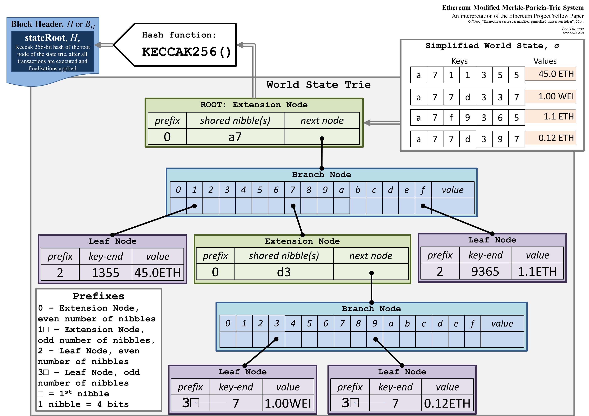

구현 패킷 트라이는 Merkle 패트리샤는 MPT에서, MPT는 저장 사용자 계정에 사용되는 매우 중요한 데이터 구조 이더넷 광장이며,이 데이터 구조가 실제로 트리는의 변형 인 데이터 구조를 언급이를 참조하려면 여기를 사용하려고 상태 및 변경, 거래 정보, 거래 정보 영수증. MPT는 실제로 세 가지 데이터 구조, 즉 트리는, 패트리샤 트리는 및 해시 트리의 조합입니다. 다음의 세 가지 데이터 구조를 설명한다.

## 트라이 트리 (인용 설명 http://dongxicheng.org/structure/trietree/)
또한 트라이, 트라이 또는 프리픽스 트리라고도 트리는 트리, 문자 트라이는 트리 (26) 등의 다중 트리 구조의 빠른 검색을위한 시스템으로서, 상기 디지털 트라이 10 트리이다.

트라이 나무는 메모리 공간을 절약하기 위해 공통 접두어 문자열을 활용할 수 있습니다. 여섯 개 문자열이 저장되어있는 트라이로, 아래의 노드 (10)와 같이 차, 10,에, 여관에서, int 형 :

당신이 공간을 절약하기 위해 &quot;의&quot;단 하나의 복사본을 저장 할 수 있도록 트라이 트리에서, 여관에서 문자열과 공공 INT 접두사는, &quot;에&quot;입니다. 물론, 실질적으로 시스템 내에 문자열 및 문자열이 많은 수의 공통 프리픽스, 대응하는 메모리는 불이익 트라이 트리 인 트라이 트리를 소비하는 경우.

트라이 트리 기본 속성은 다음과 같이 요약 될 수있다 :

- 각 노드의 루트 노드가 아닌 다른 문자를 포함하지 않는 루트 노드는 하나의 문자가 포함되어 있습니다.
- 루트 노드에서 하나의 노드에 대응하는 문자, 문자 스트링을 연결하는 경로를 통해 노드.
- 하위 각 노드는 동일하지가 포함되어 있습니다.

## 패트리샤는 시도 (접두사 트리)
각 문자열에 할당 된 노드에서 트리는와 함께 트리는 차이가 있지만,이 공통 노드 저하로 트리는 긴 문자열 배열하지 않고는 불가능합니다 접두어 나무. 해커에 의해 건설 될 이더넷 광장에서이 노드의 많은 서비스 거부 공격이 발생할 수 있습니다. 차이는 접두사 트리 노드 일반적인 접두사 있다면, 공통 접두어를 사용하거나 단일 노드에 남아있는 모든 노드를한다는 것입니다. 타이어 패트리샤 최적화 상대적으로 긍정적는 다음과 같습니다 :

팔 키 값 쌍에 저장도는 특성 접두사 트리 것을 알 수있다.

|Key		   | value |
| ------------- | ---: |
|6c0a5c71ec20bq3w|5	 |
|6c0a5c71ec20CX7j|27	|
|6c0a5c71781a1FXq|18	|
|6c0a5c71781a9Dog|64	|
|6c0a8f743b95zUfe|30	|
|6c0a8f743b95jx5R|2	 |
|6c0a8f740d16y03G|43	|
|6c0a8f740d16vcc1|48	|

## 해시 트리 (참고 http://blog.csdn.net/wo541075754/article/details/54632929)
또한 일반적 정의에 의해, 해시 나무라고는 Merkle 트리, 트리 저장된 해시 값. 해시 트리 데이터 블록 (파일 또는 파일의 예를 들면, 컬렉션) 해시 값을 떠난다. 비 리프 노드는 해시의 연결된 문자열에 해당하는 자식 노드입니다.

내가 최고 해시를 받았을 때는 Merkle 트리의 주요 역할이며, 해시 값은 트리 정보 전체 조각의 요약, 데이터 변경의 내부에 나무가 자리를 차지하게되면, 최고 해시 값의 변화로 이어질 것을 나타냅니다. 상위 해시 값이 내부 이동합니다 블록 체인의 헤더 영역에 저장되고, 증명해야하는 지역은 퇴근 후 헤더입니다. 이만큼 내가 헤더 영역을 얻을, 당신은 블록 정보를 확인할 수 있다는 것을 의미한다. 더 자세한 내용은 블로그를 참조하시기 바랍니다. 자세한 설명.

## 이더넷 광장 MPT
각 MPT 광장 지구 이더넷 헤더는 세 나무가 있었다 포함

- 무역 트리
- 영수증 트리 (트랜잭션의 실행 중에 일부 데이터)
- 상태 트리 (계정 정보, 계약 계정과 사용자 계정)

도 두 영역, 하부 헤더이고 상태 루트 TX 루트 수신 루트 저장소이 세 나무 뿌리, 상기 제 2 디스플레이 데이터 블록을 변경 (27 -&gt; 45)시 계정 175 당신 만이 계정과 연결된 일부 데이터를 저장해야하지만 이전 데이터 블록은 정상 방문을 계속 할 수 있습니다. (데이터 구조는이 기능은 불변 프로그래밍 언어와 다소 유사하다)

자세한 구조

## 옐로우 북 공식적인 정의 (부록 D.이는 Merkle 패트리샤 트리를 수정)

공식적으로, 우리는 입력 값 J가 키 값 쌍을 (키 값이 바이트 배열)를 포함한다고 가정

이러한 경우, 처리 설정, 우리는 다음의 키와 값을 나타내는 등의 식별 데이터를 사용하여 (J I 세트 중 어떤, I0는 키이고, I1은 값을 나타낸다)

어떤 특정한 바이트, 우리는 Y가 헥스 프리픽스 인코딩을 의미 니블 (4 비트) 세트의 세트에 기술되어 상기 대응 니블 (니블)를 표현할 수있다 (니블은 채택 된 분기 노드와 브랜치 노드 구조 및 부호화 키 플래그에 대한 후속 설명)

우리는 뿌리 HASH 값 표시하기 위해 트라이 기능 정의 (전체 트리 .root 값을 구축하는 층의 수를 의미, 기능 C의 두 번째 인수를 0)

우리는 또한 N의 함수는 트라이 노드 기능을 정의합니다. 구성 노드가, 우리가 사용하는 경우, RLP 구조는 인코딩. 저장 복잡도를 감소시키기위한 수단으로서, RLP 노드보다 32 바이트, 우리는 우리가 직접 HASH 노드를 저장하는 이러한 큰 RLP에 대한 값을 보관.
우리는 C 노드 함수를 정의 :

트리는는 잎에 뿌리에서 통과 기수 트리와 유사한 방식에서는 단일 키 - 값 쌍을 구축 할 수 있습니다. 키 각 지점 노드에서 하나의 니블 (기수 나무와 같은)를 얻었다 통과 축적. 다른 기수 나무는 키의 복수 같은 접두사를 공유하는 경우, 또는 단일 키의 경우 두 개의 노드를 제공하기 위해 최적화 된 고유의 접미사를 가지고 있습니다. 이 경우, 또는 단일 확장의 경우 고유 키, 두 개의 노드 최적화를 가진. 통과 할 때 따라서, 두 개의 노드가 다른 유형의 확장에서하고 잠재적 니블을 취득 복수의 각 잎 수 있습니다. 트리는 트리에서 세 개의 노드가 있습니다 :

- ** 리프 노드 (리프) 리프 노드가 두 개의 필드를 포함 ** 첫번째 필드는 니블 나머지 키 코드, 제 2 니블 부호화 방법 매개 변수는 제 2 참 필드 값입니다
- ** 확장 노드 (증축)가 ** 확장 노드는 제 1 필드 나머지 키는 적어도 두 개의 노드가 부호화 니블의 남은 부분을 공유 할 수있다, 두 개의 필드를 포함하고 두 번째 필드 n은 (J, J)
- ** 분기 노드 (점) ** 분기 노드가 탐색에서의 요점이 니블의 여섯 개 가능한 값의 각각의 제 16 개 항목에 대응하는 필드 (17)를 포함한다. 첫번째 필드 (17)가 현재 노드에 저장되는 엔드 노드 (예를 들면, 각각 세 개의 키 (ABC, ABD, AB) 필드 (17 개)에 저장 노드 AB의 가치가있다)

필요한 경우 분기 노드가 아닌 트리는 트리 만 사용하는 것은 어떤 지점 노드가 없을 수 있습니다, 하나의 빈 키 값 쌍입니다. 당신이이 세 개의 노드를 정의하는 수식을 사용하는 경우 다음과 같이 다음 공식은 다음과 같습니다
도면에서 HP는 RLP RLP 시퀀스의 함수 인 사용 함수 헥스 프리픽스 인코딩을 나타내는 반 바이트 코딩 포맷이다.

도의 해석에 관한 세 가지 경우에.

- 전류 KV에게 데이터의 한 세트를 부호화하는 경우,이 데이터는 제 규칙에 따라 인코딩된다.
- 코딩 KV의 현재 세트는 공통 접두어를 필요로하면, 최대 공통 접두어를 추출하고 처리를 위해 상기 제 규칙을 사용한다.
- 키가 HP 인코딩 사용하고 있기 때문에하지 이가지 경우 위, 다음, 분할의 분기 노드 집합을 사용하는 경우, 그것은 단지 0-15이 분기 16 가지있을 수 있습니다. 또한 U의 값을 반복적으로 n으로 정의한다는 것을 알 수 있고, 노드는 여기 끝났다 경우, 제 17 개 요소 V는 이러한 경우를 위해 준비된다.

어떻게 데이터가 저장되어야하며,이 저장되지 방법, 도시하지 않은 오렌지 북의 설명에 정의. 그래서 이것은 구현의 문제이다. 우리는 단순히 해시로 J에 매핑 기능을 정의합니다. 우리는 어떤 J를 들어, 오직 고유 한 값 해시가 있다고 생각합니다.

### 옐로우 북 (16 진수 - 접두사 인코딩)의 공식적인 정의 - 진수 접두사 코드
육각 프리픽스 코드 바이트 코드 배열 니블 임의의 수의 효과적인 방법이다. 트리는 트리에 사용하는 경우, 노드 유형 사이에 명확 것 (유일한 장소 사용하는 것) 추가 플래그를 저장하는 것이 가능하다.

그것은 (Y 세트로 표시) 반 바이트의 범위로서 정의 부울지도 바이트 시퀀스와 함께 (B의 집합으로 표시) HP의 함수이다 :

낮은 패리티 비트 인코딩 된 비트 길이의 제 2 인코딩 된 비트 플래그 값의 하위 비트, 즉, 첫번째 바이트는 두 니블 높은 플래그를 포함한다. 니블 짝수의 경우, 바이트의 첫번째 니블 제 니블 홀수의 경우는 제로이다. 나머지 바이트 나머지 모든 니블 (지금도).

## 소스 코드 구현
### trie/encoding.go
트라이 세 작업 인코딩 형식 변환의 주요 처리를 encoding.go. 세 가지 인코딩 형식은 인코딩 형식의 다음과 같은 세 가지 종류의.

- ** KEYBYTES 인코딩 **이 인코딩 형식은 API의 대부분이 트리는 코딩 형식 여기에 사용되며, 기본 키 바이트 배열이다
- ** HEX 인코딩 ** 각 바이트 니블 키를 포함하는 상기 인코딩 형식 및 임의의 &#39;종료&#39;에 접속되는 테일 부분이 &#39;종료&#39;는 엔드 노드의 노드가 리프 노드 또는 확장 나타낸다 . 노드가 사용하기 위해 메모리에로드되면 이러한 노드는 때문에 쉽게 접근 할 수의, 때.
- ** COMPACT 인코딩 **이 인코딩 형식은 진수 - 접두사 인코딩을 제공 오렌지 북의 정상입니다,이 인코딩 형식이 인코딩 형식의 또 다른 버전이,에 저장 될 수있다 ** * HEX 인코딩으로 볼 수있다 때 데이터베이스 디스크 공간을 저장합니다.

t 홀수 니블 니블 플래그 정상적인 부호화 바이트 keybytes keybytes 시퀀스 플래그 : 전자로서 이해
- 정보 일반 전체 바이트 (8 비트)에 저장 keybytes
- 니블 니블 (4 비트) 포맷 정보 저장에 따른 헥스. 컴팩트 한 사용을 위해
- 수정는 Merkle 패트리샤 트리 키의 오렌지 북의 노드 수 있도록하기 위해, 바이트 길이가 짝수 코딩 진수 형식입니다. 낮은 비트에서 2 비트 입질 할 최초 니블 플래그 t 홀수 마크를 내림차순으로 저장된다. 컴팩트 의해 코딩 KeyBytes, 보관이 용이 짝수 (즉, 전체 바이트)와 t 헥스 니블 니블 플래그의 경우 증가

코드 구현은 주로 세 가지 코딩의 상호 변환을 달성하고, 공통 접두어를 얻는 방법에 관한 것이다.

	func hexToCompact(hex []byte) []byte {
		terminator := byte(0)
		if hasTerm(hex) {
			terminator = 1
			hex = hex[:len(hex)-1]
		}
		buf := make([]byte, len(hex)/2+1)
		buf[0] = terminator << 5 // the flag byte
		if len(hex)&1 == 1 {
			buf[0] |= 1 << 4 // odd flag
			buf[0] |= hex[0] // first nibble is contained in the first byte
			hex = hex[1:]
		}
		decodeNibbles(hex, buf[1:])
		return buf
	}
	
	func compactToHex(compact []byte) []byte {
		base := keybytesToHex(compact)
		base = base[:len(base)-1]
		// apply terminator flag
		if base[0] >= 2 { //전반 바이트 플래그에 의해 결정된 t를 삭제 플래그 TODO keybytesToHex 1 출력의 종료 후, 다시 추가하고. 중복 작업
			base = append(base, 16)
		}
		// apply odd flag
		chop := 2 - base[0]&1
		return base[chop:]
	}
	
	func keybytesToHex(str []byte) []byte {
		l := len(str)*2 + 1
		var nibbles = make([]byte, l)
		for i, b := range str {
			nibbles[i*2] = b / 16
			nibbles[i*2+1] = b % 16
		}
		nibbles[l-1] = 16
		return nibbles
	}
	
	// hexToKeybytes turns hex nibbles into key bytes.
	// This can only be used for keys of even length.
	func hexToKeybytes(hex []byte) []byte {
		if hasTerm(hex) {
			hex = hex[:len(hex)-1]
		}
		if len(hex)&1 != 0 {
			panic("can't convert hex key of odd length")
		}
		key := make([]byte, (len(hex)+1)/2) //할 일이 결정되어 있지만, 1 더하기 2로 나누어 +1 무효 논리 짝수 렌 (16 진수)
		decodeNibbles(hex, key)
		return key
	}
	
	func decodeNibbles(nibbles []byte, bytes []byte) {
		for bi, ni := 0, 0; ni < len(nibbles); bi, ni = bi+1, ni+2 {
			bytes[bi] = nibbles[ni]<<4 | nibbles[ni+1]
		}
	}
	
	// prefixLen returns the length of the common prefix of a and b.
	func prefixLen(a, b []byte) int {
		var i, length = 0, len(a)
		if len(b) < length {
			length = len(b)
		}
		for ; i < length; i++ {
			if a[i] != b[i] {
				break
			}
		}
		return i
	}
	
	// hasTerm returns whether a hex key has the terminator flag.
	func hasTerm(s []byte) bool {
		return len(s) > 0 && s[len(s)-1] == 16
	}

### 데이터 구조
노드 구성이 fullNode 확장자 노드 및 리프 노드에 대응하는 분기 노드 shortNode 오렌지 북이다 오렌지 북에 대응하는 4 가지로 나눌 노드를 알 수있다 (결국 구하기 위해 대응하는 리프 노드 shortNode.Val의 일종) valueNode (인 또는 분기 노드 (fullNode))

	type node interface {
		fstring(string) string
		cache() (hashNode, bool)
		canUnload(cachegen, cachelimit uint16) bool
	}
	
	type (
		fullNode struct {
			Children [17]node // Actual trie node data to encode/decode (needs custom encoder)
			flags	nodeFlag
		}
		shortNode struct {
			Key   []byte
			Val   node
			flags nodeFlag
		}
		hashNode  []byte
		valueNode []byte
	)

트라이 구조는, 루트는 백엔드 KV가 저장되는 DB를의 트라이의 최종 구조는 다음 내부에서 데이터베이스를로드하는 데 필요한 시간을 시작, KV의 양식을 통해 갈 필요가 데이터베이스에 저장되어, 현재의 루트 노드가 포함되어 있습니다. 해시 값을로드의 시작 시간 originalRoot, 데이터베이스가 트라이를 통해 해시 값의 전체 조각 안에 복원 할 수 있습니다. cachegen 필드는 현재 캐시 시대 트리는 트리, 작동 시간을 커밋 각 호출을 나타냅니다, 그것은 캐시 시대 트리는 트리를 증가시킬 것이다. 메모리를 절약하기 위해 cachelimit 매개 변수 시대 캐시 노드보다 큰 경우, 노드는 캐시 내부에서 언로드됩니다 - 시간 캐시 노드는 현재 캐시 시간이 경우, 상위 노드에 추가됩니다. 캐시가 얼마나 오래 사용하지, 다음은 메모리 공간을 절약하기 위해 캐시에서 제거하면 사실,이는 LRU 캐시 업데이트 알고리즘이다.

	// Trie is a Merkle Patricia Trie.
	// The zero value is an empty trie with no database.
	// Use New to create a trie that sits on top of a database.
	//
	// Trie is not safe for concurrent use.
	type Trie struct {
		root		 node
		db		   Database
		originalRoot common.Hash
	
		// Cache generation values.
		// cachegen increases by one with each commit operation.
		// new nodes are tagged with the current generation and unloaded
		// when their generation is older than than cachegen-cachelimit.
		cachegen, cachelimit uint16
	}

### , 트리는 트리를 넣고 찾아 삭제
트리는 통화 기능의 새로운 초기화, 해쉬 함수는 해시 값의 값이 null가 아닌 경우, 데이터베이스 매개 변수 값을 허용하고, 그것이 데이터베이스에서 트리는를로드하는 기존의 설명, 방법은 전체 조각을로드라고 trei.resolveHash 트라이 트리,이 방법이 소개됩니다 따릅니다. 루트 비어, 새로운 나무 트리는 복귀됩니다.

	func New(root common.Hash, db Database) (*Trie, error) {
		trie := &Trie{db: db, originalRoot: root}
		if (root != common.Hash{}) && root != emptyRoot {
			if db == nil {
				panic("trie.New: cannot use existing root without a database")
			}
			rootnode, err := trie.resolveHash(root[:], nil)
			if err != nil {
				return nil, err
			}
			trie.root = rootnode
		}
		return trie, nil
	}

당신은 당신이 작업을 삽입 지점을 삽입 할 수 있습니다 찾을 때까지 루트에서 시작 재귀 호출의 방법으로 삽입 트리는 트리, 그것은 내려다보고있다. 현재 노드의 변수 노드는 현재 프리픽스 키 부분이 처리되어있다, 삽입, 더 키 플레이 키 처리부, 전체 키 = 프리픽스 + 키 없다. 값이 삽입 될 수있는 값이다. 반환 값은 삽입이 완료된 후 (더티) 트리는 트리 노드는 서브 트리의 루트 노드로 변경되었는지 여부 불리언 연산자, 에러는 에러 메시지이다.

- 노드 유형이 전무의 경우합니다 (트리는에서 새로운 노드는 무기 호),이 시간은 전체 트리를 직접 다시 shortNode 빈 입자은 {키, 값, t.newFlag ()},이 때 나무의 전체 조각 지금은 shortNode 노드가 포함되어 있습니다.
- 현재의 루트 노드 유형 shortNode 경우 프리픽스 동등한 공개 키 인 경우 (즉, 리프 노드) 계산 1 공통 프리픽스는 다음 두 키의 설명은, 동일한 동일 값 (더티 == false)의 경우, 오류가 반환됩니다. 업데이트 된 값 shortNode에 오류가없는 경우 반환합니다. 일반적인 접두사가 정확히 일치하지 않는 경우, 다음 분기 노드 노드 연결 뒤에 연장 별도의 노드 (노드 확장)를 형성하는 공통의 접두사를 추출 할 필요가 짧은 분기 노드 뒤에 두 개의 노드를 연결하는 상황을 참조하십시오. 첫 번째 분기 노드의 건설 (: = fullNode 지점 {플래그 : t.newFlag는 ()}), 다음 분기 노드의 위치는 나머지 노드 t.insert 아이들이 짧은 삽입을 호출합니다. 작은 세부 사항 키 코드는 HEX 인코딩이며, 터미네이터로 끝나는,있다. 우리는 키 우리는 ab0x16는 노드 삽입, 루트 키가 abc0x16입니다 고려. 다음 branch.Children은 [키 [matchlen] 제대로 작동 할 수, 0 * 16는 최초의 17 자녀 지점 노드를 가리 킵니다. 경기 길이는 달리, 직접 다시 분기 노드에 다음 접두어 노드로 shortNode 노드 0 인 경우.
- 현재 노드가 fullNode (즉, 브랜치 노드)의 경우, 단지 생성 된 새 노드의 다음 해당 자식 노드, 해당 자식 노드 삽입 방법에 직접 문의하십시오.
- 현재 노드 hashNode이면 hashNode 현재 노드가 내부 메모리에로드 또는 다음 데이터베이스, 제 호 t.resolveHash에 저장되지 않았 음을 의미한다 (N, 프리픽스)를 메모리에로드하고 그 노드의 부하를 호출 삽입 방법을 삽입한다.

삽입 코드

	func (t *Trie) insert(n node, prefix, key []byte, value node) (bool, node, error) {
		if len(key) == 0 {
			if v, ok := n.(valueNode); ok {
				return !bytes.Equal(v, value.(valueNode)), value, nil
			}
			return true, value, nil
		}
		switch n := n.(type) {
		case *shortNode:
			matchlen := prefixLen(key, n.Key)
			// If the whole key matches, keep this short node as is
			// and only update the value.
			if matchlen == len(n.Key) {
				dirty, nn, err := t.insert(n.Val, append(prefix, key[:matchlen]...), key[matchlen:], value)
				if !dirty || err != nil {
					return false, n, err
				}
				return true, &shortNode{n.Key, nn, t.newFlag()}, nil
			}
			// Otherwise branch out at the index where they differ.
			branch := &fullNode{flags: t.newFlag()}
			var err error
			_, branch.Children[n.Key[matchlen]], err = t.insert(nil, append(prefix, n.Key[:matchlen+1]...), n.Key[matchlen+1:], n.Val)
			if err != nil {
				return false, nil, err
			}
			_, branch.Children[key[matchlen]], err = t.insert(nil, append(prefix, key[:matchlen+1]...), key[matchlen+1:], value)
			if err != nil {
				return false, nil, err
			}
			// Replace this shortNode with the branch if it occurs at index 0.
			if matchlen == 0 {
				return true, branch, nil
			}
			// Otherwise, replace it with a short node leading up to the branch.
			return true, &shortNode{key[:matchlen], branch, t.newFlag()}, nil
	
		case *fullNode:
			dirty, nn, err := t.insert(n.Children[key[0]], append(prefix, key[0]), key[1:], value)
			if !dirty || err != nil {
				return false, n, err
			}
			n = n.copy()
			n.flags = t.newFlag()
			n.Children[key[0]] = nn
			return true, n, nil
	
		case nil:
			return true, &shortNode{key, value, t.newFlag()}, nil
	
		case hashNode:
			// We've hit a part of the trie that isn't loaded yet. Load
			// the node and insert into it. This leaves all child nodes on
			// the path to the value in the trie.
			rn, err := t.resolveHash(n, prefix)
			if err != nil {
				return false, nil, err
			}
			dirty, nn, err := t.insert(rn, prefix, key, value)
			if !dirty || err != nil {
				return false, rn, err
			}
			return true, nn, nil
	
		default:
			panic(fmt.Sprintf("%T: invalid node: %v", n, n))
		}
	}

트라이 트리 가져 오기 방법은 기본적으로 트라이을 통과하는 매우 간단합니다, 키 정보를 얻을 수있다.

	func (t *Trie) tryGet(origNode node, key []byte, pos int) (value []byte, newnode node, didResolve bool, err error) {
		switch n := (origNode).(type) {
		case nil:
			return nil, nil, false, nil
		case valueNode:
			return n, n, false, nil
		case *shortNode:
			if len(key)-pos < len(n.Key) || !bytes.Equal(n.Key, key[pos:pos+len(n.Key)]) {
				// key not found in trie
				return nil, n, false, nil
			}
			value, newnode, didResolve, err = t.tryGet(n.Val, key, pos+len(n.Key))
			if err == nil && didResolve {
				n = n.copy()
				n.Val = newnode
				n.flags.gen = t.cachegen
			}
			return value, n, didResolve, err
		case *fullNode:
			value, newnode, didResolve, err = t.tryGet(n.Children[key[pos]], key, pos+1)
			if err == nil && didResolve {
				n = n.copy()
				n.flags.gen = t.cachegen
				n.Children[key[pos]] = newnode
			}
			return value, n, didResolve, err
		case hashNode:
			child, err := t.resolveHash(n, key[:pos])
			if err != nil {
				return nil, n, true, err
			}
			value, newnode, _, err := t.tryGet(child, key, pos)
			return value, newnode, true, err
		default:
			panic(fmt.Sprintf("%T: invalid node: %v", origNode, origNode))
		}
	}

일시적으로 도입의 트리는 방법을 삭제, 코드의 루트는 비교적 유사한 삽입

### 직렬화 및 트리는의 직렬화
메모리의 주요 서열 데이터베이스 내부 직렬화 데이터 메모리 표현으로 트리는 데이터 로딩을 지칭 나타내는 데이터를 데이터베이스에 저장하는 것을 의미한다. 저장 편의 시퀀스의 주된 목적은, 메모리 크기를 감소시킨다. 역 직렬화 객체는 메모리에 저장된 데이터를로드 트리는 쿼리의 삽입을 용이하게하기 위해, 수정 및 기타 필요하다.

중요한 역할 트리는 시퀀스는 앞에서 설명한 (호환) 인코딩 및 RLP 인코딩 형식이다. 세부 구조를 가지고있는 오렌지 북의 순서.

트리는 사용 방법은 내부보다 상세한 기준 trie_test.go이다. 여기 간단한 프로세스를 사용하여 나열합니다. 트리는 먼저 빈 트리 작성 방법 직렬화) (일부 데이터, 마지막 통화 trie.Commit 삽입과 해시 값 (뿌리)을 얻었다, 상기 수치는 KEC이다 ((J, C 0)) 또는 트라이 (J).

	func TestInsert(t *testing.T) {
		trie := newEmpty()
		updateString(trie, "doe", "reindeer")
		updateString(trie, "dog", "puppy")
		updateString(trie, "do", "cat")
		root, err := trie.Commit()
	}

(가) ()의 커밋에서의 키 프로세스를 분석해 보겠습니다. 일련의 호출 후, 결국 해시 방법 hasher.go을했다.

	func (t *Trie) Commit() (root common.Hash, err error) {
		if t.db == nil {
			panic("Commit called on trie with nil database")
		}
		return t.CommitTo(t.db)
	}
	// CommitTo writes all nodes to the given database.
	// Nodes are stored with their sha3 hash as the key.
	//
	// Committing flushes nodes from memory. Subsequent Get calls will
	// load nodes from the trie's database. Calling code must ensure that
	// the changes made to db are written back to the trie's attached
	// database before using the trie.
	func (t *Trie) CommitTo(db DatabaseWriter) (root common.Hash, err error) {
		hash, cached, err := t.hashRoot(db)
		if err != nil {
			return (common.Hash{}), err
		}
		t.root = cached
		t.cachegen++
		return common.BytesToHash(hash.(hashNode)), nil
	}
	
	func (t *Trie) hashRoot(db DatabaseWriter) (node, node, error) {
		if t.root == nil {
			return hashNode(emptyRoot.Bytes()), nil, nil
		}
		h := newHasher(t.cachegen, t.cachelimit)
		defer returnHasherToPool(h)
		return h.hash(t.root, db, true)
	}

우리는 아래 간략하게 해시 방법에서, 해시 방법은 주로 두 가지 작업을 수행합니다. 다른 하나는 원래의 트리 구조의 해시 보존 가변 캐시에 저장된 해시 값을 계산하고, 원래의 트리 구조 및 가변 캐시를 유지하는 것이다.

주된 흐름은 원래 처음 통화 h.hashChildren의 해시 값을 계산한다 (N, DB)은 모든 자식 노드의 해시 값을 추구하고, 자식 노드 자식 노드의 원래 해시 값을 대체. 그것은 잎에서 뿌리까지 계산 차례로, 재귀 호출의 과정이다. 그리고, 현재 노드 캐시 노드에 현재 노드의 해시 값의 해시 값을 계산하는 저장 수단을 호출 더티 거짓 (새로 true로 만든 노드의 오염 값)에 대한 매개 변수를 설정하고 반환.

반환 값은 캐시 노드 변수는 기존 노드를 포함하고, 노드가 노드의 해시 값을 포함한다. 변수 반환에게 해시 값을 해시 현재 노드의 (이 값은 실제로 노드와 노드의 모든 자식 노드를 기준으로 계산됩니다).

작은 세부 사항이 있습니다 : 루트 해시 함수는 힘 매개 변수에 해당하는 경우, 전화, 자식 노드의 힘이 호출되는 다른 매개 변수는 false입니다. 힘의 사용은 파라미터 || C (J, ⅰ) || &lt;32도 C (J, I) 해시 계산하고, 또한 어떤 경우 루트 노드 해시 계산을 보장하는 경우.
	
	// hash collapses a node down into a hash node, also returning a copy of the
	// original node initialized with the computed hash to replace the original one.
	func (h *hasher) hash(n node, db DatabaseWriter, force bool) (node, node, error) {
		// If we're not storing the node, just hashing, use available cached data
		if hash, dirty := n.cache(); hash != nil {
			if db == nil {
				return hash, n, nil
			}
			if n.canUnload(h.cachegen, h.cachelimit) {
				// Unload the node from cache. All of its subnodes will have a lower or equal
				// cache generation number.
				cacheUnloadCounter.Inc(1)
				return hash, hash, nil
			}
			if !dirty {
				return hash, n, nil
			}
		}
		// Trie not processed yet or needs storage, walk the children
		collapsed, cached, err := h.hashChildren(n, db)
		if err != nil {
			return hashNode{}, n, err
		}
		hashed, err := h.store(collapsed, db, force)
		if err != nil {
			return hashNode{}, n, err
		}
		// Cache the hash of the node for later reuse and remove
		// the dirty flag in commit mode. It's fine to assign these values directly
		// without copying the node first because hashChildren copies it.
		cachedHash, _ := hashed.(hashNode)
		switch cn := cached.(type) {
		case *shortNode:
			cn.flags.hash = cachedHash
			if db != nil {
				cn.flags.dirty = false
			}
		case *fullNode:
			cn.flags.hash = cachedHash
			if db != nil {
				cn.flags.dirty = false
			}
		}
		return hashed, cached, nil
	}

자신의 해시에 자식 노드를 모두 대체 hashChildren 방법은, 당신은 캐시 변수는 원래 트리는 트리의 전체 구조를 정복하기 위해 변수 노드 핸들 자식 노드의 해시 값으로 붕괴 교체를 참조 할 수 있습니다.

- 현재 노드가 shortNode, 컴팩트 인코딩에 진수 인코딩에서 첫 번째 대안 collapsed.Key 경우, 다음 재귀 호출 방법은 해시 및 해시 캐시 노드, 아이가 너무 넣어 노드들이 다른 해시 값이 자식 노드가 될 계산
- 현재 노드가 다음 자식 노드의 해시 값을 하위 노드를 대체 각 하위 노드를 탐색, fullNode이면
- 아이가없는 그렇지 않으면이 노드의. 직접 돌아갑니다.

코드

	// hashChildren replaces the children of a node with their hashes if the encoded
	// size of the child is larger than a hash, returning the collapsed node as well
	// as a replacement for the original node with the child hashes cached in.
	func (h *hasher) hashChildren(original node, db DatabaseWriter) (node, node, error) {
		var err error
	
		switch n := original.(type) {
		case *shortNode:
			// Hash the short node's child, caching the newly hashed subtree
			collapsed, cached := n.copy(), n.copy()
			collapsed.Key = hexToCompact(n.Key)
			cached.Key = common.CopyBytes(n.Key)
	
			if _, ok := n.Val.(valueNode); !ok {
				collapsed.Val, cached.Val, err = h.hash(n.Val, db, false)
				if err != nil {
					return original, original, err
				}
			}
			if collapsed.Val == nil {
				collapsed.Val = valueNode(nil) // Ensure that nil children are encoded as empty strings.
			}
			return collapsed, cached, nil
	
		case *fullNode:
			// Hash the full node's children, caching the newly hashed subtrees
			collapsed, cached := n.copy(), n.copy()
	
			for i := 0; i < 16; i++ {
				if n.Children[i] != nil {
					collapsed.Children[i], cached.Children[i], err = h.hash(n.Children[i], db, false)
					if err != nil {
						return original, original, err
					}
				} else {
					collapsed.Children[i] = valueNode(nil) // Ensure that nil children are encoded as empty strings.
				}
			}
			cached.Children[16] = n.Children[16]
			if collapsed.Children[16] == nil {
				collapsed.Children[16] = valueNode(nil)
			}
			return collapsed, cached, nil
	
		default:
			// Value and hash nodes don't have children so they're left as were
			return n, original, nil
		}
	}

노드의 모든 자식 노드에 자식 노드가 다른 해시 값이 될 경우 저장 방법은, 노드 rlp.Encode 인코딩 방법을 직접 호출, 인코딩 값이 32보다 작은 경우,이 노드는 루트 아니다 처들이 저장되어 있는지 여부를 부모 노드는 직접 h.sha.Write 해시 계산 방법을 호출하고, 데이터베이스로 인코딩 된 해시 값과 어느 다음 해시 값을 반환 저장된다.

이상 32 개 해시 값이 데이터베이스 내에 저장되는 각 노드가 알 수있는

	func (h *hasher) store(n node, db DatabaseWriter, force bool) (node, error) {
		// Don't store hashes or empty nodes.
		if _, isHash := n.(hashNode); n == nil || isHash {
			return n, nil
		}
		// Generate the RLP encoding of the node
		h.tmp.Reset()
		if err := rlp.Encode(h.tmp, n); err != nil {
			panic("encode error: " + err.Error())
		}
	
		if h.tmp.Len() < 32 && !force {
			return n, nil // Nodes smaller than 32 bytes are stored inside their parent
		}
		// Larger nodes are replaced by their hash and stored in the database.
		hash, _ := n.cache()
		if hash == nil {
			h.sha.Reset()
			h.sha.Write(h.tmp.Bytes())
			hash = hashNode(h.sha.Sum(nil))
		}
		if db != nil {
			return hash, db.Put(hash, h.tmp.Bytes())
		}
		return hash, nil
	}

트라이의 직렬화 과정. 그 전에 생성 프로세스 트리는 트리를 기억하십시오. = trie.resolveHash (루트 [:] 닐) 파라미터의 루트 해시 값이 널이 아니라면, 그것은 rootNode를, ERR을 호출 방법 rootNode를 노드에 도착. 노드는 먼저 콘텐츠 안에 부호화 RLP의 해시 값을 통해 데이터베이스로부터 획득한다. 그런 다음 내용을 구문 분석 decodeNode를 호출합니다.

	func (t *Trie) resolveHash(n hashNode, prefix []byte) (node, error) {
		cacheMissCounter.Inc(1)
	
		enc, err := t.db.Get(n)
		if err != nil || enc == nil {
			return nil, &MissingNodeError{NodeHash: common.BytesToHash(n), Path: prefix}
		}
		dec := mustDecodeNode(n, enc, t.cachegen)
		return dec, nil
	}
	func mustDecodeNode(hash, buf []byte, cachegen uint16) node {
		n, err := decodeNode(hash, buf, cachegen)
		if err != nil {
			panic(fmt.Sprintf("node %x: %v", hash, err))
		}
		return n
	}

필드 (17)의 경우는, 두 개의 필드 shortNode 노드 인 경우 엔드 노드에서이 코드가, 소속을 결정하는리스트 RLP의 길이에 따라 decodeNode 방법은 다음이를 fullNode, 그때 각 분석 함수를 호출한다.

	// decodeNode parses the RLP encoding of a trie node.
	func decodeNode(hash, buf []byte, cachegen uint16) (node, error) {
		if len(buf) == 0 {
			return nil, io.ErrUnexpectedEOF
		}
		elems, _, err := rlp.SplitList(buf)
		if err != nil {
			return nil, fmt.Errorf("decode error: %v", err)
		}
		switch c, _ := rlp.CountValues(elems); c {
		case 2:
			n, err := decodeShort(hash, buf, elems, cachegen)
			return n, wrapError(err, "short")
		case 17:
			n, err := decodeFull(hash, buf, elems, cachegen)
			return n, wrapError(err, "full")
		default:
			return nil, fmt.Errorf("invalid number of list elements: %v", c)
		}
	}

decodeShort 방법은 최종 터미네이션 키 심볼이 있는지의 여부로 판단된다 리프 노드 또는 중간 노드이다. 잎 노드 터미네이터가있는 경우 SplitString 방법에 의해 파싱 브로 shortNode를 생성한다. 하지만 터미네이터, 그 노드의 확장은 decodeRef 노드를 통해 남아있는 해결 한 다음 shortNode을 생성하는 없습니다.

	func decodeShort(hash, buf, elems []byte, cachegen uint16) (node, error) {
		kbuf, rest, err := rlp.SplitString(elems)
		if err != nil {
			return nil, err
		}
		flag := nodeFlag{hash: hash, gen: cachegen}
		key := compactToHex(kbuf)
		if hasTerm(key) {
			// value node
			val, _, err := rlp.SplitString(rest)
			if err != nil {
				return nil, fmt.Errorf("invalid value node: %v", err)
			}
			return &shortNode{key, append(valueNode{}, val...), flag}, nil
		}
		r, _, err := decodeRef(rest, cachegen)
		if err != nil {
			return nil, wrapError(err, "val")
		}
		return &shortNode{key, r, flag}, nil
	}

타입 목록 경우 데이터 타입에 따른 분석 방법 decodeRef, 그 콘텐츠 &lt;32의 값이있을 수 있고, 그 다음 decodeNode 해상도 부른다. 노드가 비어있는 경우 해시 값이 다음 hashNode가 반환 구성되어있는 경우, 다음의 필요성이 hashNode를 해결하기 위해 계속, 당신은 resolveHash 메서드를 호출 계속할 필요가 진행 할 의지가 없음을 지적, 빈 반환합니다. 여기 decodeShort 방법은 완료 호출합니다.

	func decodeRef(buf []byte, cachegen uint16) (node, []byte, error) {
		kind, val, rest, err := rlp.Split(buf)
		if err != nil {
			return nil, buf, err
		}
		switch {
		case kind == rlp.List:
			// 'embedded' node reference. The encoding must be smaller
			// than a hash in order to be valid.
			if size := len(buf) - len(rest); size > hashLen {
				err := fmt.Errorf("oversized embedded node (size is %d bytes, want size < %d)", size, hashLen)
				return nil, buf, err
			}
			n, err := decodeNode(nil, buf, cachegen)
			return n, rest, err
		case kind == rlp.String && len(val) == 0:
			// empty node
			return nil, rest, nil
		case kind == rlp.String && len(val) == 32:
			return append(hashNode{}, val...), rest, nil
		default:
			return nil, nil, fmt.Errorf("invalid RLP string size %d (want 0 or 32)", len(val))
		}
	}

decodeFull 방법. 동일의 프로세스 루트 decodeShort 방법.

	
	func decodeFull(hash, buf, elems []byte, cachegen uint16) (*fullNode, error) {
		n := &fullNode{flags: nodeFlag{hash: hash, gen: cachegen}}
		for i := 0; i < 16; i++ {
			cld, rest, err := decodeRef(elems, cachegen)
			if err != nil {
				return n, wrapError(err, fmt.Sprintf("[%d]", i))
			}
			n.Children[i], elems = cld, rest
		}
		val, _, err := rlp.SplitString(elems)
		if err != nil {
			return n, err
		}
		if len(val) > 0 {
			n.Children[16] = append(valueNode{}, val...)
		}
		return n, nil
	}

### 캐시 관리 트리는 트리
캐시 관리 트리는 트리. 두 개의 매개 변수를하는 cachegen, 하나 cachelimit가 트리는 트리 구조를 기억하십시오. 캐시 매개 변수를 제어이 두 매개 변수를 설정합니다. 트라이 나무마다 한 번씩 현재 cachegen 1 증가로 이어질 것입니다 방법을 커밋하기 위해 호출합니다.
	
	func (t *Trie) CommitTo(db DatabaseWriter) (root common.Hash, err error) {
		hash, cached, err := t.hashRoot(db)
		if err != nil {
			return (common.Hash{}), err
		}
		t.root = cached
		t.cachegen++
		return common.BytesToHash(hash.(hashNode)), nil
	}

삽입되었을 경우, 트리는가 현재 노드에 저장 cachegen 것이다.

	func (t *Trie) insert(n node, prefix, key []byte, value node) (bool, node, error) {
				....
				return true, &shortNode{n.Key, nn, t.newFlag()}, nil
			}

	// newFlag returns the cache flag value for a newly created node.
	func (t *Trie) newFlag() nodeFlag {
		return nodeFlag{dirty: true, gen: t.cachegen}
	}

trie.cachegen 경우 - node.cachegen&gt; cachelimit, 당신은 내부 노드 메모리에서 제거 할 수 있습니다. 몇 가지가 수정되지 않습니다, 커밋 후 그 노드는 다음 내부에 넣어 다른 노드에 메모리를 저장하기 위해 메모리 노드에서 언로드.

우리 hasher.hash 방법의 제거 과정은,이 방법은 커밋 할 때 호출됩니다. 다음 노드를 제거 호출이 반환의 canUnload 방법 true의 경우, 그 반환 값은, 단지 해시 노드를 반환 관찰 및 노드 노드를 반환하지 않았습니다,이 노드에 대한 참조입니다, GC는 곧 제거 될 것입니다. 노드가 제거 된 후에는 노드 hashNode이 노드와 자식 노드로 표시됩니다. 후속 요구는이 방법에 의해 사용하는 경우 노드 메모리로로드한다.

	func (h *hasher) hash(n node, db DatabaseWriter, force bool) (node, node, error) {
		if hash, dirty := n.cache(); hash != nil {
			if db == nil {
				return hash, n, nil
			}
			if n.canUnload(h.cachegen, h.cachelimit) {
				// Unload the node from cache. All of its subnodes will have a lower or equal
				// cache generation number.
				cacheUnloadCounter.Inc(1)
				return hash, hash, nil
			}
			if !dirty {
				return hash, n, nil
			}
		}

canUnload 메소드는 인터페이스 노드를 호출하는 다른 방법이다.

	// canUnload tells whether a node can be unloaded.
	func (n *nodeFlag) canUnload(cachegen, cachelimit uint16) bool {
		return !n.dirty && cachegen-n.gen >= cachelimit
	}
	
	func (n *fullNode) canUnload(gen, limit uint16) bool  { return n.flags.canUnload(gen, limit) }
	func (n *shortNode) canUnload(gen, limit uint16) bool { return n.flags.canUnload(gen, limit) }
	func (n hashNode) canUnload(uint16, uint16) bool	  { return false }
	func (n valueNode) canUnload(uint16, uint16) bool	 { return false }
	
	func (n *fullNode) cache() (hashNode, bool)  { return n.flags.hash, n.flags.dirty }
	func (n *shortNode) cache() (hashNode, bool) { return n.flags.hash, n.flags.dirty }
	func (n hashNode) cache() (hashNode, bool)   { return nil, true }
	func (n valueNode) cache() (hashNode, bool)  { return nil, true }

### 메르켈 proof.go 트리는 트리를 증명
주로 지정된 키 증거 증거를 얻는 방법을 증명, 두 가지 방법을 제공, 증거 리프 노드에 루트에서 모든 노드의 해시 값의 목록 것으로 판명. 방법 VerifyProof 및 키의 존재를 확인하는 값 roothash 키 인증서 증거에 동의합니다.

루트 노드에서 시작 방법을 증명. 리스트에 노드에 저장된 해시 값 후. 그리고 돌아갑니다.
	
	// Prove constructs a merkle proof for key. The result contains all
	// encoded nodes on the path to the value at key. The value itself is
	// also included in the last node and can be retrieved by verifying
	// the proof.
	//
	// If the trie does not contain a value for key, the returned proof
	// contains all nodes of the longest existing prefix of the key
	// (at least the root node), ending with the node that proves the
	// absence of the key.
	func (t *Trie) Prove(key []byte) []rlp.RawValue {
		// Collect all nodes on the path to key.
		key = keybytesToHex(key)
		nodes := []node{}
		tn := t.root
		for len(key) > 0 && tn != nil {
			switch n := tn.(type) {
			case *shortNode:
				if len(key) < len(n.Key) || !bytes.Equal(n.Key, key[:len(n.Key)]) {
					// The trie doesn't contain the key.
					tn = nil
				} else {
					tn = n.Val
					key = key[len(n.Key):]
				}
				nodes = append(nodes, n)
			case *fullNode:
				tn = n.Children[key[0]]
				key = key[1:]
				nodes = append(nodes, n)
			case hashNode:
				var err error
				tn, err = t.resolveHash(n, nil)
				if err != nil {
					log.Error(fmt.Sprintf("Unhandled trie error: %v", err))
					return nil
				}
			default:
				panic(fmt.Sprintf("%T: invalid node: %v", tn, tn))
			}
		}
		hasher := newHasher(0, 0)
		proof := make([]rlp.RawValue, 0, len(nodes))
		for i, n := range nodes {
			// Don't bother checking for errors here since hasher panics
			// if encoding doesn't work and we're not writing to any database.
			n, _, _ = hasher.hashChildren(n, nil)
			hn, _ := hasher.store(n, nil, false)
			if _, ok := hn.(hashNode); ok || i == 0 {
				// If the node's database encoding is a hash (or is the
				// root node), it becomes a proof element.
				enc, _ := rlp.EncodeToBytes(n)
				proof = append(proof, enc)
			}
		}
		return proof
	}

파라미터 rootHash 주요 파라미터와는 온 및 데이터베이스 내부 대응할 수 있는지 여부를 확인하기 위해 배열 증거를 수신하는 방법 VerifyProof.

	// VerifyProof checks merkle proofs. The given proof must contain the
	// value for key in a trie with the given root hash. VerifyProof
	// returns an error if the proof contains invalid trie nodes or the
	// wrong value.
	func VerifyProof(rootHash common.Hash, key []byte, proof []rlp.RawValue) (value []byte, err error) {
		key = keybytesToHex(key)
		sha := sha3.NewKeccak256()
		wantHash := rootHash.Bytes()
		for i, buf := range proof {
			sha.Reset()
			sha.Write(buf)
			if !bytes.Equal(sha.Sum(nil), wantHash) {
				return nil, fmt.Errorf("bad proof node %d: hash mismatch", i)
			}
			n, err := decodeNode(wantHash, buf, 0)
			if err != nil {
				return nil, fmt.Errorf("bad proof node %d: %v", i, err)
			}
			keyrest, cld := get(n, key)
			switch cld := cld.(type) {
			case nil:
				if i != len(proof)-1 {
					return nil, fmt.Errorf("key mismatch at proof node %d", i)
				} else {
					// The trie doesn't contain the key.
					return nil, nil
				}
			case hashNode:
				key = keyrest
				wantHash = cld
			case valueNode:
				if i != len(proof)-1 {
					return nil, errors.New("additional nodes at end of proof")
				}
				return cld, nil
			}
		}
		return nil, errors.New("unexpected end of proof")
	}
	
	func get(tn node, key []byte) ([]byte, node) {
		for {
			switch n := tn.(type) {
			case *shortNode:
				if len(key) < len(n.Key) || !bytes.Equal(n.Key, key[:len(n.Key)]) {
					return nil, nil
				}
				tn = n.Val
				key = key[len(n.Key):]
			case *fullNode:
				tn = n.Children[key[0]]
				key = key[1:]
			case hashNode:
				return key, n
			case nil:
				return key, nil
			case valueNode:
				return nil, n
			default:
				panic(fmt.Sprintf("%T: invalid node: %v", tn, tn))
			}
		}
	}

### security_trie.go은 트리는 암호화
의도적으로 회피 증가 액세스 시간의 긴 키 결과를 사용하려면, 트라이에 대한 security_trie 래퍼는, 모든 키는 해시 값 keccak256 알고리즘 계산으로 변환됩니다. 원본 데이터베이스 키에 대응하는 점포 해시 값 안에있다.

	type SecureTrie struct {
		trie			 Trie// 원래 트리는 트리
		hashKeyBuf   [SecureKeyLength] // 바이트 BUF 해시 값 계산
		secKeyBuf		[200]byte		   값 저장 시간에 해당하는 데이터베이스 접두사 // 해시 키
		secKeyCache	  map[string][]byte  // 기록 해시 값과 해당 키 매핑
		secKeyCacheOwner *SecureTrie // Pointer to self, replace the key cache on mismatch
	}

	func NewSecure(root common.Hash, db Database, cachelimit uint16) (*SecureTrie, error) {
		if db == nil {
			panic("NewSecure called with nil database")
		}
		trie, err := New(root, db)
		if err != nil {
			return nil, err
		}
		trie.SetCacheLimit(cachelimit)
		return &SecureTrie{trie: *trie}, nil
	}
	
	// Get returns the value for key stored in the trie.
	// The value bytes must not be modified by the caller.
	func (t *SecureTrie) Get(key []byte) []byte {
		res, err := t.TryGet(key)
		if err != nil {
			log.Error(fmt.Sprintf("Unhandled trie error: %v", err))
		}
		return res
	}
	
	// TryGet returns the value for key stored in the trie.
	// The value bytes must not be modified by the caller.
	// If a node was not found in the database, a MissingNodeError is returned.
	func (t *SecureTrie) TryGet(key []byte) ([]byte, error) {
		return t.trie.TryGet(t.hashKey(key))
	}
	func (t *SecureTrie) CommitTo(db DatabaseWriter) (root common.Hash, err error) {
		if len(t.getSecKeyCache()) > 0 {
			for hk, key := range t.secKeyCache {
				if err := db.Put(t.secKey([]byte(hk)), key); err != nil {
					return common.Hash{}, err
				}
			}
			t.secKeyCache = make(map[string][]byte)
		}
		return t.trie.CommitTo(db)
	}
